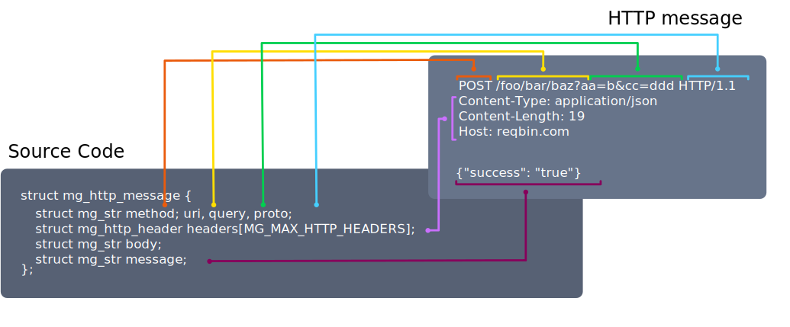
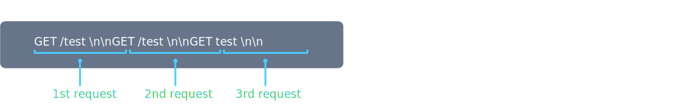
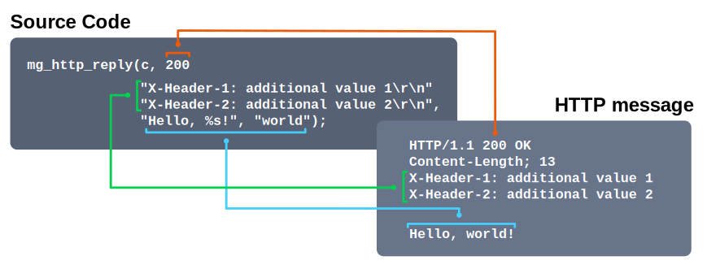
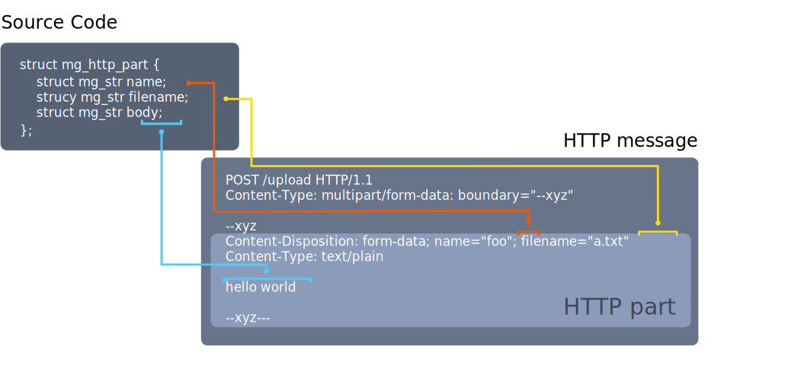
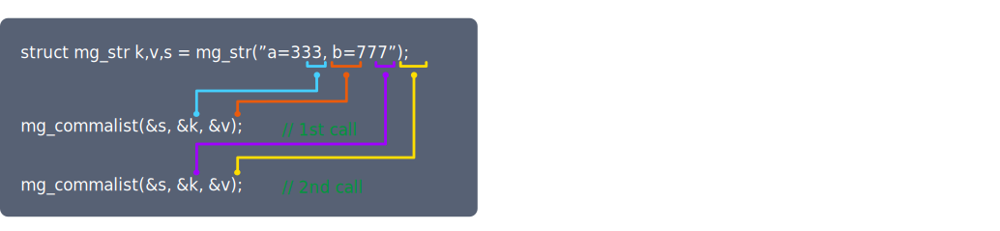
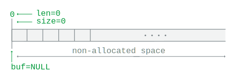
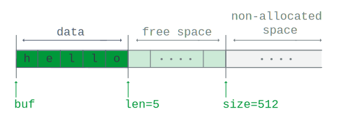
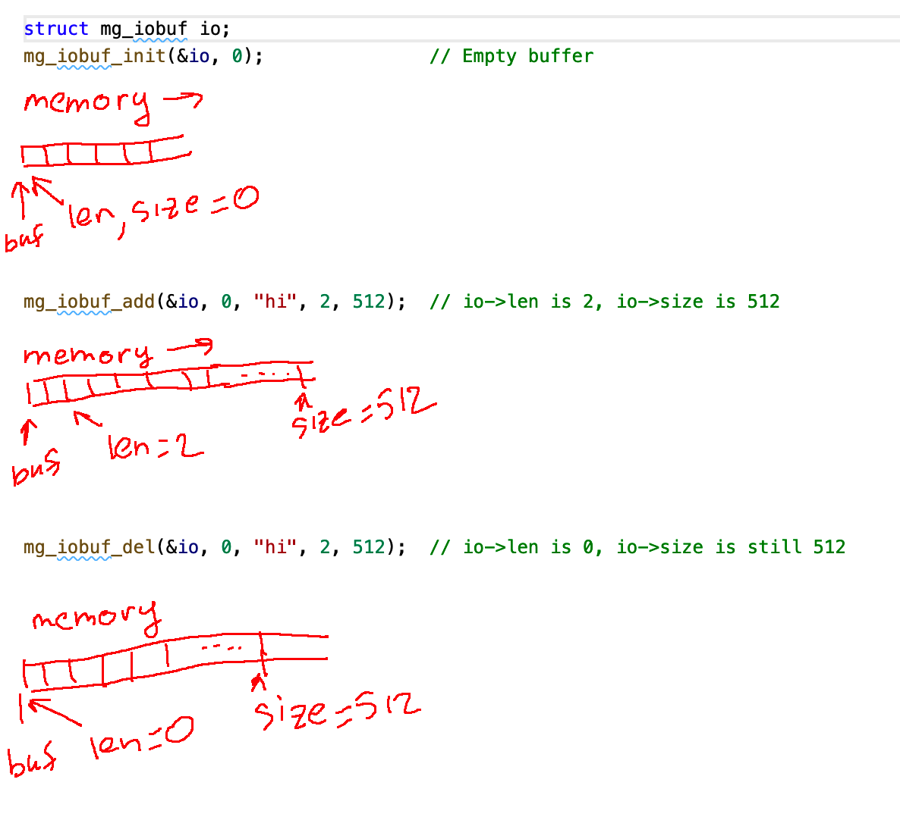

# User Guide


## Introduction

Mongoose is a networking library for C/C++. It implements event-driven,
non-blocking APIs for TCP, UDP, HTTP, WebSocket, MQTT.  It connects devices
and brings them online. Since 2004, a number of open source and commercial
products have utilized it. It even runs on the
International Space Station! Mongoose makes embedded network programming fast,
robust, and easy.

Mongoose has two basic data structures:

- `struct mg_mgr` - An event manager that holds all active connections
- `struct mg_connection` - A single connection descriptor

Connections could be listening, outbound, or inbound. Outbound
connections are created by the `mg_connect()` call. Listening connections are
created by the `mg_listen()` call. Inbound connections are those accepted by a
listening connection. Each connection is described by a `struct mg_connection`
structure, which has a number of fields. All fields are exposed to the
application by design, to give an application full visibility into
Mongoose's internals.

## 2-minute integration guide

In order to integrate Mongoose into an existing C/C++ application or firmware,
please use the following steps:

**Step 1.** Copy
[mongoose.c](https://raw.githubusercontent.com/cesanta/mongoose/master/mongoose.c)
and
[mongoose.h](https://raw.githubusercontent.com/cesanta/mongoose/master/mongoose.h)
into the source code tree

**Step 2.** Add the following lines in your `main.c` file:

```c
#include "mongoose.h"
...

static void fn(struct mg_connection *c, int ev, void *ev_data, void *fn_data) {
  struct mg_http_serve_opts opts = {.root_dir = "."};   // Serve local dir
  if (ev == MG_EV_HTTP_MSG) mg_http_serve_dir(c, ev_data, &opts);
}
...

int main() {
  ...

  struct mg_mgr mgr;                                
  mg_mgr_init(&mgr);
  mg_http_listen(&mgr, "0.0.0.0:8000", fn, NULL);     // Create listening connection
  for (;;) mg_mgr_poll(&mgr, 1000);                   // Block forever
}
```

**Step 3.** Add `mongoose.c` to the build and recompile - and that is it!


`mg_mgr_poll()` iterates over all connections, accepts new connections, sends and
receives data, closes connections, and calls event handler functions for the
respective events.

Each connection has two event handler functions: `c->fn` and `c->pfn`.  The
`c->fn` is a user-specified event handler function. The `c->pfn` is a
protocol-specific handler function that is set implicitly. For example, a
`mg_http_listen()` sets `c->pfn` to a Mongoose's HTTP event handler.  A
protocol-specific handler is called before a user-specific handler.  It parses
incoming data and may invoke protocol-specific events like `MG_EV_HTTP_MSG`.


<span class="badge bg-danger">NOTE:</span>
Since Mongoose's core is not protected against concurrent accesses, make
sure that all `mg_*` API functions are called from the same thread or RTOS
task.

## Send and receive buffers

Each connection has a send and receive buffer:
- `struct mg_connection::send` - Data to be sent to a peer
- `struct mg_connection::recv` - Data received from a peer

When data arrives, Mongoose appends received data to the `recv` and triggers a
`MG_EV_READ` event. The user may send data back by calling one of the output
functions, like `mg_send()`, `mg_printf()` or a protocol-specific function like
`mg_ws_send`. Output functions append data to the `send` buffer.  When Mongoose
successfully writes data to the socket, it discards data from struct `mg_connection::send`
and sends an `MG_EV_WRITE` event.

## Event handler function

Each connection has an event handler function associated with it, which
must be implemented by the user. Event handler is the key element of
Mongoose, since it defines the connection's behavior. See below
for an example of an event handler function:

```c
// Event handler function defines connection's behavior
static void fn(struct mg_connection *c, int ev, void *ev_data, void *fn_data) {
  if (ev == MG_EV_READ) {
    mg_send(c, c->recv.buf, c->recv.len);   // Implement echo server
    c->recv.len = 0;                        // Delete received data
  }
}
```

- `struct mg_connection *c` - A connection that received an event
- `int ev` - An event number, defined in mongoose.h. For example, when data
  arrives on an inbound connection, `ev` would be `MG_EV_READ`
- `void *ev_data` - Points to the event-specific data, and it has a different
  meaning for different events. For example, for an `MG_EV_READ` event,
  `ev_data`
  is an `int *` pointing to the number of bytes received from a remote
  peer and saved into the `c->recv` IO buffer. The exact meaning of `ev_data` is
  described for each event. Protocol-specific events usually have `ev_data`
  pointing to structures that hold protocol-specific information
- `void *fn_data` - A user-defined pointer for the connection, which is a
  placeholder for application-specific data. This `fn_data` pointer is set
  during the `*_listen()` or `*_connect()` call, and it is stored in the
  `c->fn_data`. Listening connections copy the value of `c->fn_data` to the
  newly accepted connection, so all accepted connections initially share the
  same `fn_data` pointer. It is fine to update/replace that pointer for
  any connection at any time by setting `c->fn_data = new_value;`

## Events

Below is the list of events triggered by Mongoose, taken as-is from `mongoose.h`.
For each event, a comment describes the meaning of the `ev_data` pointer passed
to an event handler:

```c
enum {
  MG_EV_ERROR,       // Error                        char *error_message
  MG_EV_OPEN,        // Connection created           NULL
  MG_EV_POLL,        // mg_mgr_poll iteration        uint64_t *milliseconds
  MG_EV_RESOLVE,     // Host name is resolved        NULL
  MG_EV_CONNECT,     // Connection established       NULL
  MG_EV_ACCEPT,      // Connection accepted          NULL
  MG_EV_READ,        // Data received from socket    struct mg_str *
  MG_EV_WRITE,       // Data written to socket       long *bytes_written
  MG_EV_CLOSE,       // Connection closed            NULL
  MG_EV_HTTP_MSG,    // HTTP request/response        struct mg_http_message *
  MG_EV_HTTP_CHUNK,  // HTTP chunk (partial msg)     struct mg_http_message *
  MG_EV_WS_OPEN,     // Websocket handshake done     struct mg_http_message *
  MG_EV_WS_MSG,      // Websocket msg, text or bin   struct mg_ws_message *
  MG_EV_WS_CTL,      // Websocket control msg        struct mg_ws_message *
  MG_EV_MQTT_CMD,    // MQTT low-level command       struct mg_mqtt_message *
  MG_EV_MQTT_MSG,    // MQTT PUBLISH received        struct mg_mqtt_message *
  MG_EV_MQTT_OPEN,   // MQTT CONNACK received        int *connack_status_code
  MG_EV_SNTP_TIME,   // SNTP time received           uint64_t *milliseconds
  MG_EV_USER,        // Starting ID for user events
};
```

## Connection flags

`struct mg_connection` has a bitfield with connection flags.  Flags are binary:
they can be either 0 or 1.  Some flags are set by Mongoose and must be not
changed by an application code. For example, the `is_udp` flag tells the application if
that connection is UDP or not.  Some flags can be changed by application, for
example, the `is_draining` flag, if set by an application, tells Mongoose to send
the remaining data to a peer, and when everything is sent, close the connection.

<span class="badge bg-danger me-1"> NOTE: </span>User-changeable flags are:
`is_hexdumping`, `is_draining`, `is_closing`.

This is taken from `mongoose.h` as-is:

```c
struct mg_connection {
  ...
  unsigned is_listening : 1;   // Listening connection
  unsigned is_client : 1;      // Outbound (client) connection
  unsigned is_accepted : 1;    // Accepted (server) connection
  unsigned is_resolving : 1;   // Non-blocking DNS resolv is in progress
  unsigned is_connecting : 1;  // Non-blocking connect is in progress
  unsigned is_tls : 1;         // TLS-enabled connection
  unsigned is_tls_hs : 1;      // TLS handshake is in progress
  unsigned is_udp : 1;         // UDP connection
  unsigned is_websocket : 1;   // WebSocket connection
  unsigned is_hexdumping : 1;  // Hexdump in/out traffic
  unsigned is_draining : 1;    // Send remaining data, then close and free
  unsigned is_closing : 1;     // Close and free the connection immediately
  unsigned is_full : 1;        // Stop reads, until cleared
  unsigned is_readable : 1;    // Connection is ready to read
  unsigned is_writable : 1;    // Connection is ready to write
};
```

## Best practices

- If you need to perform any sort of initialisation of your connection,
  do it by catching `MG_EV_OPEN` event. That event is sent immediately
  after a connection has been allocated and added to the event manager,
  but before anything else:
  ```c
  static void fn(struct mg_connection *c, int ev, void *ev_data, void *fn_data) {
    if (ev == MG_EV_OPEN) {
      ... // Do your initialisation
    }
  ```
- If you need to keep some connection-specific data, you have two options.
  First, use `c->fn_data` pointer. That pointer is passed to the event handler
  as last parameter:
  ```c
  static void fn(struct mg_connection *c, int ev, void *ev_data, void *fn_data) {
    if (ev == MG_EV_OPEN) {
      c->fn_data = malloc(123);       // Change our fn_data
    } else if (ev == MG_EV_CLOSE) {
      free(fn_data);  // Don't forget to free!
    }
    ...
  }

  // Every accepted connection inherit NULL pointer as c->fn_data, but we change
  // it per-connection to something else
  mg_http_listen(&mgr, "http://localhost:1234", fn, NULL);
  ```
  Another option is to use `c->label` buffer, which can
  hold some amount of connection-specific data without extra memory allocation:
  ```c
  static void fn(struct mg_connection *c, int ev, void *ev_data, void *fn_data) {
    if (ev == MG_EV_WS_OPEN) {
      c->label[0] = 'W'; // Established websocket connection, store something
      ...
  ```
- If you need to close the connection, set `c->is_draining = 1;` in your
  event handler function. That tells the event manager to send all remaining
  data in a send buffer ("drain" the connection), then close the connection.
  If you need to close
  the connection immediately without draining, use `c->is_closing = 1;`
- Use `mg_http_reply()` function to create HTTP responses. That function
  properly sets the `Content-Length` header, which is important. Of course
  you can create responses manually, e.g. with `mg_printf()` function,
  but be sure to set the `Content-Length` header:
  ```c
  mg_printf(c, "HTTP/1.1 200 OK\r\Content-Length: %d\r\n\r\n%s", 2, "hi");
  ```
  Alternatively, use chunked transfer enconding:
  ```c
  mg_printf(c, "HTTP/1.1 200 OK\r\nTransfer-Encoding: chunked\r\n\r\n");
  mg_http_printf_chunk(c, "%s", "foo");
  mg_http_printf_chunk(c, "%s", "bar");
  mg_http_printf_chunk(c, "");  // Don't forget the last empty chunk
  ```
- On embedded environment, make sure that serving task has enough stack:
  give it 2k for simple RESTful serving, or 4-8k for complex dynamic/static
  serving. In certain environments, it is necessary to adjust heap size, too.
  By default, IO buffer allocation size `MG_IO_SIZE` is 2048: change it to 512
  to trim run-time per-connection memory consumption.

## Build options

Mongoose source code ships in two files:
- [mongoose.h](https://github.com/cesanta/mongoose/blob/master/mongoose.h) - API definitions
- [mongoose.c](https://github.com/cesanta/mongoose/blob/master/mongoose.c) - Implementation

Therefore, to integrate Mongoose into an application, simply copy these two
files to the application's source tree. The `mongoose.c` and `mongoose.h` files
are actually an amalgamation - non-amalgamated sources can be found at
https://github.com/cesanta/mongoose/tree/master/src

Mongoose has two types of build constants (preprocessor definitions) that
affect the build: a target architecture, and tunables. In order to set the
option during build time, use the `-D OPTION` compiler flag:

```sh
$ cc app0.c mongoose.c                                        # Use defaults!
$ cc app1.c mongoose.c -D MG_ENABLE_IPV6=1                    # Build with IPv6 enabled
$ cc app2.c mongoose.c -D MG_ARCH=MG_ARCH_FREERTOS_LWIP       # Set architecture
$ cc app3.c mongoose.c -D MG_ENABLE_SSI=0 -D MG_IO_SIZE=8192  # Multiple options
```

The list of supported architectures is defined in the [arch.h](https://github.com/cesanta/mongoose/blob/master/src/arch.h)
header file. Normally, there is no need to explicitly specify the architecture.
The architecture is guessed during the build, so setting it is not usually required.

| Name | Description |
| ---- | ----------- |
|MG_ARCH_UNIX | All UNIX-like systems like Linux, MacOS, FreeBSD, etc |
|MG_ARCH_WIN32 | Windows systems |
|MG_ARCH_ESP32 | Espressif's ESP32 |
|MG_ARCH_ESP8266 | Espressif's ESP8266 |
|MG_ARCH_FREERTOS_LWIP | All systems with FreeRTOS kernel and LwIP IP stack |
|MG_ARCH_FREERTOS_TCP | All systems with FreeRTOS kernel and FreeRTOS-Plus-TCP IP stack |
|MG_ARCH_CUSTOM | A custom architecture, discussed in the next section |

The other class of build constants is defined in
[src/config.h](https://github.com/cesanta/mongoose/blob/master/src/config.h)
together with their default values. These are tunables that include/exclude
a certain functionality or change relevant parameters.

Here is a list of build constants and their default values:

| Name | Default | Description |
| ---- | ------- | ----------- |
|MG_ENABLE_SOCKET | 1 | Use BSD socket low-level API |
|MG_ENABLE_MBEDTLS | 0 | Enable mbedTLS library |
|MG_ENABLE_OPENSSL | 0 | Enable OpenSSL library |
|MG_ENABLE_IPV6 | 0 | Enable IPv6 |
|MG_ENABLE_MD5 | 0 | Use native MD5 implementation |
|MG_ENABLE_SSI | 1 | Enable serving SSI files by `mg_http_serve_dir()` |
|MG_ENABLE_CUSTOM_RANDOM | 0 | Provide custom RNG function `mg_random()` |
|MG_ENABLE_CUSTOM_TLS | 0 | Enable custom TLS library |
|MG_ENABLE_CUSTOM_MILLIS | 0 | Enable custom `mg_millis()` function |
|MG_ENABLE_PACKED_FS | 0 | Enable embedded FS support |
|MG_ENABLE_FATFS | 0 | Enable embedded FAT FS support |
|MG_ENABLE_LINES | undefined | If defined, show source file names in logs |
|MG_IO_SIZE | 2048 | Granularity of the send/recv IO buffer growth |
|MG_MAX_RECV_SIZE | (3 * 1024 * 1024) | Maximum recv buffer size |
|MG_MAX_HTTP_HEADERS | 40 | Maximum number of HTTP headers |
|MG_HTTP_INDEX | "index.html" | Index file for HTML directory |
|MG_FATFS_ROOT | "/" | FAT FS root directory |
|MG_PUTCHAR | putchar | Character output function, used by logging |

<span class="badge bg-danger">NOTE:</span> the `MG_IO_SIZE` constant also sets
maximum UDP message size, see
[issues/907](https://github.com/cesanta/mongoose/issues/907) for details. If the
application uses large UDP messages, increase the `MG_IO_SIZE` limit
accordingly.

## Custom build

A custom build should be used for cases which is not covered by the
existing architecture options (e.g., an embedded architecture that
uses some proprietary RTOS and network stack). In order to build on such
systems, follow the outline below:

1. Add `-DMG_ARCH=MG_ARCH_CUSTOM` to your build flags.
2. Create a file called `mongoose_custom.h`, with defines and includes that
are relevant to your platform. Mongoose uses `bool` type, `MG_DIRSEP` define,
and optionally other structures like `DIR *` depending on the functionality
you have enabled - see previous section. Below is an example:

```c
#include <stdbool.h>
#include <stdarg.h>

#define MG_DIRSEP '/'
#define MG_INT64_FMT "%lld"
```
3. This step is optional, and only required if you intend to use a custom
   TCP/IP stack. To do that, you should:
  * Disable BSD socket API: in the `mongoose_custom.h`, add
  ```c
  #define MG_ENABLE_SOCKET 0
  ```
  * Add an implementation of several internal API functions, like
  `mg_send()`, `mg_mgr_poll()`, etc. For the reference, take
  a look at the stub
  "do nothing" implementation at
  [test/mongoose_custom.c](https://github.com/cesanta/mongoose/blob/master/test/mongoose_custom.c)
  and the experimental builtin bare metal TCP/IP stack implementation
  at
  [src/mip.c](https://github.com/cesanta/mongoose/blob/master/src/mip.c)

## Minimal HTTP server

This example is a simple HTTP server that serves both static and dynamic content:

```c
#include "mongoose.h"

static void fn(struct mg_connection *c, int ev, void *ev_data, void *fn_data) {
  if (ev == MG_EV_HTTP_MSG) {
    struct mg_http_message *hm = (struct mg_http_message *) ev_data;
    if (mg_http_match_uri(hm, "/api/hello")) {
      mg_http_reply(c, 200, "", "%s\n", "hi");  // Serve dynamic content
    } else {
      struct mg_http_serve_opts opts = {.root_dir = "."};   // Serve
      mg_http_serve_dir(c, ev_data, &opts);                 // static content
    }
  }
}

int main(int argc, char *argv[]) {
  struct mg_mgr mgr;
  mg_mgr_init(&mgr);                                      // Init manager
  mg_http_listen(&mgr, "http://0.0.0.0:8000", fn, &mgr);  // Setup listener
  for (;;) mg_mgr_poll(&mgr, 1000);                       // Event loop
  mg_mgr_free(&mgr);                                      // Cleanup
  return 0;
}
```

## Minimal TCP echo server

This example is a simple TCP echo server that listens on port 1234:

```c
#include "mongoose.h"

static void cb(struct mg_connection *c, int ev, void *ev_data, void *fn_data) {
  if (ev == MG_EV_READ) {
    mg_send(c, c->recv.buf, c->recv.len);     // Echo received data back
    mg_iobuf_del(&c->recv, 0, c->recv.len);   // And discard it
  }
}

int main(int argc, char *argv[]) {
  struct mg_mgr mgr;
  mg_mgr_init(&mgr);                                // Init manager
  mg_listen(&mgr, "tcp://0.0.0.0:1234", cb, &mgr);  // Setup listener
  for (;;) mg_mgr_poll(&mgr, 1000);                 // Event loop
  mg_mgr_free(&mgr);                                // Cleanup
  return 0;
}
```


# API Reference

## Core

### struct mg\_addr

```c
struct mg_addr {
  uint16_t port;    // TCP or UDP port in network byte order
  uint32_t ip;      // IP address in network byte order
  uint8_t ip6[16];  // IPv6 address
  bool is_ip6;      // True when address is IPv6 address
};
```

This structure contains network address; it can be considered as a Mongoose equivalent for sockets `sockaddr` structure.

### struct mg\_mgr

```c
struct mg_mgr {
  struct mg_connection *conns;  // List of active connections
  struct mg_dns dns4;           // DNS for IPv4
  struct mg_dns dns6;           // DNS for IPv6
  int dnstimeout;               // DNS resolve timeout in milliseconds
  unsigned long nextid;         // Next connection ID
  void *userdata;               // Arbitrary user data pointer
};
```
Event management structure that holds a list of active connections, together
with some housekeeping information.


### struct mg\_connection

```c
struct mg_connection {
  struct mg_connection *next;  // Linkage in struct mg_mgr :: connections
  struct mg_mgr *mgr;          // Our container
  struct mg_addr loc;          // Local address
  struct mg_addr rem;          // Remote address
  void *fd;                    // Connected socket, or LWIP data
  unsigned long id;            // Auto-incrementing unique connection ID
  struct mg_iobuf recv;        // Incoming data
  struct mg_iobuf send;        // Outgoing data
  mg_event_handler_t fn;       // User-specified event handler function
  void *fn_data;               // User-specified function parameter
  mg_event_handler_t pfn;      // Protocol-specific handler function
  void *pfn_data;              // Protocol-specific function parameter
  char label[50];              // Arbitrary label
  void *tls;                   // TLS specific data
  unsigned is_listening : 1;   // Listening connection
  unsigned is_client : 1;      // Outbound (client) connection
  unsigned is_accepted : 1;    // Accepted (server) connection
  unsigned is_resolving : 1;   // Non-blocking DNS resolve is in progress
  unsigned is_connecting : 1;  // Non-blocking connect is in progress
  unsigned is_tls : 1;         // TLS-enabled connection
  unsigned is_tls_hs : 1;      // TLS handshake is in progress
  unsigned is_udp : 1;         // UDP connection
  unsigned is_websocket : 1;   // WebSocket connection
  unsigned is_hexdumping : 1;  // Hexdump in/out traffic
  unsigned is_draining : 1;    // Send remaining data, then close and free
  unsigned is_closing : 1;     // Close and free the connection immediately
  unsigned is_full : 1;        // Stop reads, until cleared
  unsigned is_readable : 1;    // Connection is ready to read
  unsigned is_writable : 1;    // Connection is ready to write
};
```

A connection - either a listening connection, or an accepted connection,
or an outbound connection.

### mg\_mgr\_init()

```c
void mg_mgr_init(struct mg_mgr *mgr);
```

Initialize event manager structure:
- Set a list of active connections to NULL
- Set default DNS servers for IPv4 and IPv6
- Set default DNS lookup timeout

Parameters:
- `mgr` - a pointer to `mg_mgr` structure that needs to be initialized

Return value: none

Usage example:

```c
struct mg_mgr mgr;
mg_mgr_init(&mgr);
```


### mg\_mgr\_poll()

```c
void mg_mgr_poll(struct mg_mgr *mgr, int ms);
```

Perform a single poll iteration. For each connection in the `mgr->conns` list:
- See if there is incoming data. If there is, read it into the `c->recv` buffer, send `MG_EV_READ` event
- See if there is data in the `c->send` buffer, and write it, send `MG_EV_WRITE` event
- If a connection is listening, accept an incoming connection if any, and send `MG_EV_ACCEPT` event to it
- Send `MG_EV_POLL` event

Parameters:
- `mgr` - an event manager to use
- `ms` - a timeout in milliseconds

Return value: none

Usage example:

```c
while (running == true) mg_mgr_poll(&mgr, 1000 /* 1 sec */);
```

### mg\_mgr\_free()

```c
void mg_mgr_free(struct mg_mgr *mgr);
```

Close all connections, and free all resources.

Parameters:
- `mgr` - an event manager to cleanup

Return value: none

Usage example:

```c
struct mg_mgr mgr;
mg_mgr_init(&mgr);
while (running == true) mg_mgr_poll(&mgr, 1000);   // Event loop
mg_mgr_free(&mgr);
```

### mg\_listen()

```c
struct mg_connection *mg_listen(struct mg_mgr *mgr, const char *url,
                                mg_event_handler_t fn, void *fn_data);
```

Create a listening connection, append this connection to `mgr->conns`.

Parameters:
- `mgr` - an event manager to use
- `url` - a URL. Specifies local IP address and port to listen on, e.g.
  `tcp://127.0.0.1:1234` or `udp://0.0.0.0:9000`
- `fn` - an event handler function
- `fn_data` - an arbitrary pointer, which will be passed as `fn_data` when an
  event handler is called. This pointer is also stored in a connection
  structure as `c->fn_data`

Return value: created connection, or `NULL` on error.

Usage example:

```c
struct mg_connection *c = mg_listen(&mgr, "tcp://127.0.0.1:8080", fn, NULL);
```

### mg\_connect()

```c
struct mg_connection *mg_connect(struct mg_mgr *mgr, const char *url,
                                 mg_event_handler_t fn, void *fn_data);
```

Create an outbound connection, append this connection to `mgr->conns`.

Parameters:
- `mgr` - An event manager to use
- `url` - A URL, specifies remote IP address/port to connect to, e.g. `http://a.com`
- `fn` - An event handler function
- `fn_data` - An arbitrary pointer, which will be passed as `fn_data` when an
  event handler is called. This pointer is also stored in a connection
  structure as `c->fn_data`

Return value: created connection, or `NULL` on error.

Note: This function does not connect to peer, it allocates required resources and
starts connect process. Once peer is really connected, `MG_EV_CONNECT` event is sent
to connection event handler.

Usage example:

```c
struct mg_connection *c = mg_connect(&mgr, "http://example.org", fn, NULL);
```

### mg\_send()

```c
int mg_send(struct mg_connection *c, const void *data, size_t size);
```

Append `data` of size `size` to the `c->send` buffer. Return number of bytes
appended.

Note: This function does not push data to the network. It only appends data to
the output buffer.  The data is being sent when `mg_mgr_poll()` is called. If
`mg_send()` is called multiple times, the output buffer grows.

Parameters:
- `c` - A connection pointer
- `data` - A pointer to data to append to the send buffer
- `size` - A data size

Return value: `true` if data appended successfully and `false` otherwise

Usage example:

```c
mg_send(c, "hi", 2);  // Append string "hi" to the output buffer
```

### mg\_printf(), mg\_vprintf()

```c
int mg_printf(struct mg_connection *, const char *fmt, ...);
int mg_vprintf(struct mg_connection *, const char *fmt, va_list ap);
```

Same as `mg_send()`, but formats data using `printf()` semantics. Return
number of bytes appended to the output buffer.
<span class="badge bg-danger">NOTE: </span> See [mg\_snprintf](#mg_snprintf-mg_vsnprintf)
for the list of supported format specifiers

Parameters:
- `c` - a connection pointer
- `fmt` - a format string in `printf` semantics

Return value: number of bytes appended to the output buffer.

Usage example:

```c
mg_printf(c, "Hello, %s!", "world"); // Add "Hello, world!" to output buffer
```

### mg\_straddr

```c
char *mg_straddr(struct mg_addr *addr, char *buf, size_t len);
```

Write stringified IP address, associated with given connection to `buf` (maximum size `len`)

Parameters:
- `addr` - A address pointer
- `buf` - A pointer to a buffer that will hold stringified address
- `len` - A buffer size

Return value: `buf` value

Usage example:

```c
char buf[100];
LOG(LL_INFO, ("%s", mg_straddr(&c->peer, buf, sizeof(buf))));
```

### mg\_wrapfd()

```c
struct mg_connection *mg_wrapfd(struct mg_mgr *mgr, int fd,
                                mg_event_handler_t fn, void *fn_data);
```

Wrap a given file descriptor `fd` into a connection, and add that connection
to the event manager. An `fd` descriptor must suport `send()`, `recv()`,
`select()` syscalls, and be non-blocking. Mongoose will treat it as a TCP
socket. The `c->rem` and `c->loc` addresses will be empty.

Parameters:
- `fd` - A file descriptor to wrap
- `mgr` - An event manager
- `fn` - A pointer to event handler function
- `ud` - A user data pointer. It will be passed to `fn` as `fn_data` parameter

Return value: Pointer to the created connection or `NULL` in case of error

### mg\_mkpipe()

```c
int mg_mkpipe(struct mg_mgr *mgr, mg_event_handler_t fn, void *fn_data, bool udp);
```

Create two interconnected sockets for inter-thread communication. One socket
is wrapped into a Mongoose connection and is added to the event manager.
Another socket is returned, and supposed to be passed to a worker thread.
When a worker thread `send()`s to socket any data, that wakes up `mgr` and
`fn` event handler reveives `MG_EV_READ` event. Also, `fn` can send any
data to a worker thread, which can be `recv()`ed by a worker thread.
If a socketpair is UDP, then it is guaranteed to send a

Parameters:
- `mgr` - an event manager
- `fn` - a pointer to event handler function
- `fn_data` - a user data pointer. It will be passed to `fn` as `fn_data` parameter
- `udp` - tells to create UDP or TCP socketpair.

Return value: created socket, or `-1` on error

Usage example: see [examples/multi-threaded](https://github.com/cesanta/mongoose/tree/master/examples/multi-threaded).

### mg\_mgr\_wakeup()

```c
bool mg_mgr_wakeup(struct mg_connection *pipe, const void *buf, size_len len);
```

Wake up an event manager that sleeps in `mg_mgr_poll()` call. This function
must be called from a separate task/thread. A calling thread can pass
some specific data to the IO thread via `buf`, `len`. The maximum value
of `len` is limited by a maximum UDP datagram size, which is 64KiB. If you need
to send a large data to the Mongoose thread, `malloc()` the data and send
a pointer to it, not the data itself. The receiving event handler can receive
a pointer, send a response, and call `free()`. Parameters:

Parameters:
- `pipe` - a special connection created by the `mg_mkpipe()` call
- `buf` - a data to send to the pipe connection. Use `""` if there is no data 
- `len` - a data length

Return value: `true` if data has been sent, `false` otherwise

Usage example: see [examples/multi-threaded](https://github.com/cesanta/mongoose/tree/master/examples/multi-threaded).


## HTTP

### struct mg\_http\_header

```c
struct mg_http_header {
  struct mg_str name;   // Header name
  struct mg_str value;  // Header value
};
```

Structure represents HTTP header, like `Content-Type: text/html`.
`Content-Type` is a header name and `text/html` is a header value.

### struct mg\_http\_message

```c
struct mg_http_message {
  struct mg_str method, uri, query, proto;             // Request/response line
  struct mg_http_header headers[MG_MAX_HTTP_HEADERS];  // Headers
  struct mg_str body;                                  // Body
  struct mg_str message;                               // Request line + headers + body
};
```

Structure represents the HTTP message.



### mg\_http\_listen()

```c
struct mg_connection *mg_http_listen(struct mg_mgr *mgr, const char *url,
                                     mg_event_handler_t fn, void *fn_data);
```

Create HTTP listener.

Parameters:
- `mgr` - An event manager
- `url` - A URL, specifies local IP address and port to listen on, e.g. `http://0.0.0.0:8000`
- `fn` - An event handler function
- `fn_data` - An arbitrary pointer, which will be passed as `fn_data` when an
  event handler is called. This pointer is also stored in a connection
  structure as `c->fn_data`

Return value: Pointer to created connection or `NULL` in case of error

Usage example:

```c
struct mg_connection *c = mg_http_listen(&mgr, "0.0.0.0:8000", fn, arg);
if (c == NULL) fatal_error("Cannot create listener");
```

### mg\_http\_connect()

```c
struct mg_connection *mg_http_connect(struct mg_mgr *, const char *url,
                                      mg_event_handler_t fn, void *fn_data);
```

Create HTTP client connection.

Note: This function does not connect to peer; it allocates required resources and
starts connect process. Once peer is really connected `MG_EV_CONNECT` event is
sent to connection event handler.

Parameters:
- `mgr` - An event manager
- `url` - A URL, specifies remote URL, e.g. `http://google.com`
- `fn` - An event handler function
- `fn_data` - An arbitrary pointer, which will be passed as `fn_data` when an
  event handler is called. This pointer is also stored in a connection
  structure as `c->fn_data`

Return value: Pointer to created connection or `NULL` in case of error

Usage example:

```c
struct mg_connection *c = mg_http_connect(&mgr, "http://google.com", fn, NULL);
if (c == NULL) fatal_error("Cannot create connection");
```

### mg\_http\_status()

```c
int mg_http_status(const struct mg_http_message *hm);
```

Get status code of the HTTP response.
Parameters:
- `hm` - Parsed HTTP response

Return value: status code, e.g. `200` for success.

### mg\_http\_get\_request\_len()

```c
int mg_http_get_request_len(const unsigned char *buf, size_t buf_len);
```

Get length of request.

The length of request is a number of bytes till the end of HTTP headers. It does
not include length of HTTP body.

Parameters:
- `buf` - A pointer to a buffer with request
- `buf_len` - Buffer length

Return value: -1 on error, 0 if a message is incomplete, or the length of request

Usage example:

```c
const char *buf = "GET /test \n\nGET /foo\n\n";
int req_len = mg_http_get_request_len(buf, strlen(buf));  // req_len == 12
```



### mg\_http\_parse()

```c
int mg_http_parse(const char *s, size_t len, struct mg_http_message *hm);
```

Parse string request into `mg_http_message` structure

Parameters:
- `s` - A request string
- `len` - A request string length
- `hm` - A pointer to a structure to store parsed request

Return value: request length (see `mg_http_get_request_len()`)

Usage example:

```c
struct mg_http_message hm;
const char *buf = "GET / HTTP/1.0\n\n";
if (mg_http_parse(buf, strlen(buf), &hm) > 0) { /* success */ }
```

### mg\_http\_printf\_chunk()

```c
void mg_http_printf_chunk(struct mg_connection *c, const char *fmt, ...);
```

Write a chunk of data in chunked encoding format, using `printf()` semantic.

Parameters:
- `c` - A connection pointer
- `fmt` - A string, format specified in `printf` semantics

Return value: None

Usage example:

```c
mg_http_printf_chunk(c, "Hello, %s!", "world");
```

### mg\_http\_write\_chunk()

```c
void mg_http_write_chunk(struct mg_connection *c, const char *buf, size_t len);
```

Write a chunk of data in chunked encoding format.

Parameters:
- `c` - A connection pointer
- `buf` - Data to write
- `len` - Data length

Return value: None

Usage example:

```c
mg_http_write_chunk(c, "hi", 2);
```

### mg\_http\_delete\_chunk()

```c
void mg_http_delete_chunk(struct mg_connection *c, struct mg_http_message *hm);
```

Remove chunk specified from input buffer.

Parameters:
- `c` - A connection pointer
- `hm` - Chunk to delete

Return value: None

Usage example:

```c
// Mongoose events handler
void fn(struct mg_connection *c, int ev, void *ev_data, void *fn_data) {
  if (ev == MG_EV_HTTP_CHUNK) {
    struct mg_http_message *hm = (struct mg_http_message *) ev_data;
    mg_http_delete_chunk(c, hm); // Remove received chunk
  }
}
```

### struct mg\_http\_serve\_opts

```c
struct mg_http_serve_opts {
  const char *root_dir;       // Web root directory, must be non-NULL
  const char *ssi_pattern;    // SSI file name pattern, e.g. #.shtml
  const char *extra_headers;  // Extra HTTP headers to add in responses
  const char *mime_types;     // Extra mime types, ext1=type1,ext2=type2,..
  const char *page404;        // Path to the 404 page, or NULL by default
  struct mg_fs *fs;           // Filesystem implementation. Use NULL for POSIX
};
```

A structure passed to `mg_http_serve_dir()` and `mg_http_serve_file()`, which
drives the behavior of those two functions.

### mg\_http\_serve\_dir()

```c
void mg_http_serve_dir(struct mg_connection *c, struct mg_http_message *hm,
                       const struct mg_http_serve_opts *opts);
```

Serve static files according to the given options. Note that in order to
enable SSI, set a `-DMG_ENABLE_SSI=1` build flag.

<span class="badge bg-danger">NOTE: </span> Avoid double dots `..` in
the `root_dir`. If you need to
reference an upper-level directory, use absolute path.

Parameters:
- `c` - Connection to use
- `hm` - HTTP message, that should be served
- `opts` - Serve options. Note that `opts.root_dir` can optionally accept
  extra comma-separated `uri=path` pairs, see example below

Return value: None

Usage example:

```c
// Mongoose events handler
void fn(struct mg_connection *c, int ev, void *ev_data, void *fn_data) {
  if (ev == MG_EV_HTTP_MSG) {
    struct mg_http_message *hm = (struct mg_http_message *) ev_data;
    struct mg_http_serve_opts opts;
    memset(&opts, 0, sizeof(opts));
    opts.root_dir = "/var/www,/conf=/etc";  // Serve /var/www. URIs starting with /conf are served from /etc
    mg_http_serve_dir(c, hm, &opts);
  }
}
```

### mg\_http\_serve\_file()

```c
void mg_http_serve_file(struct mg_connection *c, struct mg_http_message *hm,
                        const char *path, struct mg_http_serve_opts *opts);
```

Serve static file. Note that the `extra_headers` must end with `\r\n`.

Parameters:
- `c` - Connection to use
- `hm` - HTTP message to serve
- `path` - Path to file to serve
- `opts` - Serve options

Return value: None

Usage example:

```c
// Mongoose events handler
void fn(struct mg_connection *c, int ev, void *ev_data, void *fn_data) {
  if (ev == MG_EV_HTTP_MSG) {
    struct mg_http_message *hm = (struct mg_http_message *) ev_data;
    struct mg_http_serve_opts opts = {.mime_types = "png=image/png",
                                  .extra_headers = "AA: bb\r\nCC: dd\r\n"};
    mg_http_serve_file(c, hm, "a.png", &opts);  // Send file
  }
}
```

### mg\_http\_reply()

```c
void mg_http_reply(struct mg_connection *c, int status_code,
                   const char *headers, const char *body_fmt, ...);
```

Send simple HTTP response using `printf()` semantic. This function formats
response body according to a `body_fmt`, and automatically appends a correct
`Content-Length` header. Extra headers could be passed via `headers` parameter.

Parameters:
- `c` - Connection to use
- `status_code` - An HTTP response code
- `headers` - Extra headers, default NULL. If not NULL, must end with `\r\n`
- `fmt` - A format string for the HTTP body, in a printf semantics

Return value: None



Usage examples:

Send a simple JSON response:
```c
mg_http_reply(c, 200, "Content-Type: application/json\r\n", "{\"result\": %d}", 123);
```

Send JSON response using [mjson](https://github.com/cesanta/mjson) library:
```c
char *json = NULL;
mjson_printf(mjson_print_dynamic_buf, &json, "{%Q:%d}", "name", 123);
mg_http_reply(c, 200, "Content-Type: application/json\r\n", "%s", json);
free(json);
```

Send a 302 redirect:
```c
mg_http_reply(c, 302, "Location: /\r\n", "");
```

Send error:
```c
mg_http_reply(c, 403, "", "%s", "Not Authorized\n");
```

### mg\_http\_get\_header()

```c
struct mg_str *mg_http_get_header(struct mg_http_message *hm, const char *name);
```

Get HTTP header value

Parameters:
- `hm` - HTTP message to look for header
- `name` - Header name

Return value: HTTP header value or `NULL` if not found

Usage example:

```c
// Mongoose event handler
void fn(struct mg_connection *c, int ev, void *ev_data, void *fn_data) {
  if (ev == MG_EV_HTTP_MSG) {
    struct mg_http_message *hm = (struct mg_http_message *) ev_data;
    struct mg_str *s = mg_http_get_header(hm, "X-Extra-Header");
    if (s != NULL) {
      mg_http_reply(c, 200, "", "Holly molly! Header value: %.*s", (int) s->len, s->ptr);
    } else {
      mg_http_reply(c, 200, "", "Oh no, header is not set...");
    }
  }
}
```

### mg\_http\_get\_header\_var()

```c
struct mg_str mg_http_get_header_var(struct mg_str s, struct mg_str v);
```

Parse HTTP header (e.g. Cookie header) which has form
`name1=value1; name2=value2; ...` and fetch a given variable.

Parameters:
- `s` - HTTP header
- `name` - variable name name

Return value: a requested variable, or an empty string.

Usage example:

```c
struct mg_str *cookie = mg_http_get_header(hm, "Cookie");
struct mg_str token = mg_str("");

if (cookie != NULL) {
  token = mg_http_get_header_var(*cookie, mg_str("access_token"));
}
```


### mg\_http\_get\_var()

```c
int mg_http_get_var(const struct mg_str *var, const char *name, char *buf, int len);
```

Decode HTTP variable

Parameters:
- `var` - HTTP request body
- `name` - Variable name
- `buf` - Buffer to write decoded variable
- `len` - Buffer size

Return value: Length of decoded variable. A zero or negative value means error

Usage example:

```c
char buf[100] = "";
mg_http_get_var(&hm->body, "key1", buf, sizeof(buf)) {
```

### mg\_http\_creds()

```c
void mg_http_creds(struct mg_http_message *hm, char *user, size_t userlen,
                   char *pass, size_t passlen);
```

Fetch authentication credential from the request, and store into the
`user`, `userlen` and `pass`, `passlen` buffers. The credentials are looked
up in the following order:
- from the `Authorization` HTTP header,
   - Basic auth fills both user and pass
   - Bearer auth fills only pass
- from the `access_token` cookie, fills pass
- from the `?access_token=...` query string parameter, fills pass

If none is found, then both user and pass are set to empty nul-terminated strings.

Parameters:
- `hm` - HTTP message to look for credentials
- `user` - buffer to receive user name
- `userlen` - size of `user` buffer
- `pass` - buffer to receive password
- `passlen` - size of `pass` buffer

Return value: None

Usage example:

```c
// Mongoose events handler
void fn(struct mg_connection *c, int ev, void *ev_data, void *fn_data) {
  if (ev == MG_EV_HTTP_MSG) {
    struct mg_http_message *hm = (struct mg_http_message *) ev_data;
    char user[100], pass[100];
    mg_http_creds(hm, user, sizeof(user), pass, sizeof(pass)); // "user" is now user name and "pass" is now password from request
  }
}
```

### mg\_http\_match\_uri()

```c
bool mg_http_match_uri(const struct mg_http_message *hm, const char *glob);
```

Check if HTTP request matches a given glob pattern.

Parameters:
- `hm` - HTTP message to match
- `glob` - Pattern

Return value: True if HTTP request matches a given glob pattern; false otherwise

Usage example:

```c
// Mongoose events handler
void fn(struct mg_connection *c, int ev, void *ev_data, void *fn_data) {
  if (ev == MG_EV_HTTP_MSG) {
    struct mg_http_message *hm = (struct mg_http_message *) ev_data;
    if (mg_http_match_uri(hm, "/secret")) {
      mg_http_reply(c, 200, NULL, "Very big secret!");
    } else {
      mg_http_reply(c, 200, NULL, "hello world..");
    }
  }
}
```

### mg\_http\_bauth()

```c
void mg_http_bauth(struct mg_connection *c, const char *user, const char *pass);
```

Write a Basic `Authorization` header to the output buffer.

Parameters:
- `c` - Connection to use
- `user` - User name
- `pass` - Password

Return value: None

Usage example which uses Basic auth to create Stripe subscription:

```c
  mg_printf(c, "POST /v1/subscriptions HTTP/1.1\r\n"
               "Host: api.stripe.com\r\n"
               "Transfer-Encoding: chunked\r\n");
  mg_http_bauth(c, stripe_private_key, NULL);     // Add Basic auth header
  mg_printf(c, "%s", "\r\n");                     // End HTTP headers

  mg_http_printf_chunk(c, "&customer=%s", customer_id);   // Set customer
  mg_http_printf_chunk(c, "&items[0][price]=%s", price);  // And price
  mg_http_printf_chunk(c, "");                            // End request
```

### struct mg\_http\_part

```c
// Parameter for mg_http_next_multipart
struct mg_http_part {
  struct mg_str name;      // Form field name
  struct mg_str filename;  // Filename for file uploads
  struct mg_str body;      // Part contents
};
```

Structure that describes a single part of a HTTP multipart message.



### mg\_http\_next\_multipart()

```c
size_t mg_http_next_multipart(struct mg_str body, size_t offset, struct mg_http_part *part);
```

Parse the multipart chunk in the `body` at a given `offset`. An initial
`offset` should be 0. Fill up parameters in the provided `part`, which could be
NULL. Return offset to the next chunk, or 0 if there are no more chunks.

Parameters:
- `body`- Message body
- `offset` - Start offset
- `part` - Pointer to `struct mg_http_part` to fill

Return value: offset to the next chunk, or 0 if there are no more chunks.

Usage example (or see [form upload tutorial](../tutorials/form-uploads/) ):

```c
struct mg_http_part part;
size_t pos = 0;

while ((pos = mg_http_next_multipart(body, pos, &part)) != 0) {
  // Use part
}
```

A diagram below shows how `mg_http_next_multipart()` in action:


### mg\_http\_upload()

```c

int mg_http_upload(struct mg_connection *c, struct mg_http_message *hm,
                   struct mg_fs *fs, const char *dir);
```

This is a helper utility function that is used to upload large files by small
chunks.

Append HTTP POST data to a file in a specified directory.  A file name and
file offset are specified by the query string parameters:
`POST /upload?name=firmware.bin&offset=2048 HTTP/1.1`. If the offset is 0, then the
file is truncated. It is a client's responsibility to divide a file into a
smaller chunks and send a sequence of POST requests that will be handled by
this function.

Parameters:
- `c`- a connection
- `hm` - a parsed HTTP message
- `fs` - a filesystem where to write a file, e.g. `&mg_fs_posix`
- `dir` - a directory name where a file should be stored

Return value: number of bytes written

Usage example:

```c
static void fn(struct mg_connection *c, int ev, void *ev_data, void *fn_data) {
  if (ev == MG_EV_HTTP_MSG) {
    struct mg_http_message *hm = (struct mg_http_message *) ev_data;
    if (mg_http_match_uri(hm, "/upload")) {
      mg_http_upload(c, hm, &mg_fs_posix, "/tmp");
    } else {
      struct mg_http_serve_opts opts = {.root_dir = "."};   // Serve
      mg_http_serve_dir(c, ev_data, &opts);                 // static content
    }
  }
}

```

See [app.js](https://github.com/cesanta/mongoose/blob/7.5/examples/file-upload/web_root/app.js)
for the example Javascript HTML page code that takes a file and
sends it by small chunks.


## Websocket

### struct mg\_ws\_message

```c
struct mg_ws_message {
  struct mg_str data; // Websocket message data
  uint8_t flags;      // Websocket message flags
};
```

Structure represents the WebSocket message.

### mg\_ws\_connect()

```c
struct mg_connection *mg_ws_connect(struct mg_mgr *mgr, const char *url,
                                    mg_event_handler_t fn, void *fn_data,
                                    const char *fmt, ...);
```

Create client Websocket connection.

Note: this function does not connect to peer, it allocates required resources and
 starts the connect process. Once peer is really connected, the `MG_EV_CONNECT` event is
 sent to connection event handler.

Parameters:
- `mgr` - Event manager to use
- `url` - Specifies remote URL, e.g. `http://google.com`
- `opts` - MQTT options, with client ID, QoS, etc
- `fn` - An event handler function
- `fn_data` - An arbitrary pointer, which will be passed as `fn_data` when an
  event handler is called. This pointer is also stored in a connection
  structure as `c->fn_data`
- `fmt` - printf-like format string for additional HTTP headers, or NULL

Return value: Pointer to created connection or `NULL` on error

Usage example:

```c
struct mg_connection *c = mg_ws_connect(&mgr, "ws://test_ws_server.com:1000",
                                        handler, NULL, "%s", "Sec-WebSocket-Protocol: echo\r\n");
if(c == NULL) fatal("Cannot create connection");
```

### mg\_ws\_upgrade()

```c
void mg_ws_upgrade(struct mg_connection *c, struct mg_http_message *,
                   const char *fmt, ...);
```

Upgrade given HTTP connection to Websocket. The `fmt` is a printf-like
format string for the extra HTTP headers returned to the client in a
Websocket handshake. Set `fmt` to `NULL` if no extra headers need to be passed.

Parameters:
- `c` - Connection to use
- `hm` - HTTP message
- `fmt` - printf-like format string for additional HTTP headers, or NULL

Return value: None

Usage example:

```c
// Mongoose events handler
void fn(struct mg_connection *c, int ev, void *ev_data, void *fn_data) {
  if (ev == MG_EV_HTTP_MSG) {
    struct mg_http_message *hm = (struct mg_http_message *) ev_data;
    mg_ws_upgrade(c, hm, NULL);  // Upgrade HTTP to WS
  }
}
```

### mg\_ws\_send()

```c
size_t mg_ws_send(struct mg_connection *c, const char *buf, size_t len, int op);
```

Send data to websocket peer

Parameters:
- `c` - Connection to use
- `buf` - Data to send
- `len` - Data size
- `op` - Websocket message type

Return value: sent bytes count

Possible Websocket message type:

```c
#define WEBSOCKET_OP_CONTINUE 0
#define WEBSOCKET_OP_TEXT 1
#define WEBSOCKET_OP_BINARY 2
#define WEBSOCKET_OP_CLOSE 8
#define WEBSOCKET_OP_PING 9
#define WEBSOCKET_OP_PONG 10
```

Usage example:

```c
// Mongoose events handler
void fn(struct mg_connection *c, int ev, void *ev_data, void *fn_data) {
  if (ev == MG_EV_WS_OPEN) {
    struct mg_http_message *hm = (struct mg_http_message *) ev_data;
    mg_ws_send(c, "opened", 6, WEBSOCKET_OP_BINARY);  // Send "opened" to web socket connection
  }
}
```

### mg\_ws\_wrap()

```c
size_t mg_ws_wrap(struct mg_connection *c, size_t len, int op)
```

Convert data in output buffer to WebSocket format. Useful then implementing protocol over WebSocket
See [examples/mqtt-over-ws-client](https://github.com/cesanta/mongoose/tree/master/examples/mqtt-over-ws-client) for full example.

Parameters:
- `c` - Connection to use
- `len` - Bytes count to convert
- `op` - Websocket message type (see `mg_ws_send`)

Return value: New size of connection output buffer

Usage example:

```c
size_t len = c->send.len;         // Store output buffer len
mg_mqtt_login(c, s_url, &opts);   // Write MQTT login message
mg_ws_wrap(c, c->send.len - len, WEBSOCKET_OP_BINARY); // Wrap it into WS
```

## SNTP

### mg_sntp_connect()

```c
struct mg_connection *mg_sntp_connect(struct mg_mgr *mgr, const char *url,
                                      mg_event_handler_t fn, void *fn_data)
```

Connect SNTP server.

Parameters:
- `mgr` - Event manager to use
- `url` - Specifies remote URL, `time.google.com` if NULL.
- `fn` - An event handler function
- `fn_data` - An arbitrary pointer, which will be passed as `fn_data` when an
  event handler is called. This pointer is also stored in a connection
  structure as `c->fn_data`

Return value: Pointer to created connection or `NULL` on error

Usage example:

```c
static void sntp_cb(struct mg_connection *c, int ev, void *evd, void *fnd) {
  if (ev == MG_EV_SNTP_TIME) {
    // Time received
    struct timeval *tv = (struct timeval *tv)evd;
  }
}
...
mg_sntp_connect(mgr&, NULL /* connect to time.google.com */, sntp_cb, NULL);
```

### mg_sntp_request()

```c
void mg_sntp_request(struct mg_connection *c)
```

Send time request to SNTP server

Parameters:
- `c` - Connection to use

Return value: None

Usage example:

```c
mg_sntp_request(c);
```

## MQTT

### struct mg\_mqtt\_opts

```c
struct mg_mqtt_opts {
  struct mg_str client_id;    // Client id
  struct mg_str will_topic;   // Will Topic
  struct mg_str will_message; // Will Message
  uint8_t will_qos;           // Will message quality of service
  bool will_retain;           // Retain last will
  bool clean;                 // Use clean session, 0 or 1
  uint16_t keepalive;         // Keep-alive timer in seconds
};
```

Structure used to specify MQTT connection options.

### struct mg\_mqtt\_message

```c
struct mg_mqtt_message {
  struct mg_str topic;  // Topic
  struct mg_str data;   // Message data
};
```

Structure represents the MQTT message.

### mg\_mqtt\_connect()

```c
struct mg_connection *mg_mqtt_connect(struct mg_mgr *mgr, const char *url,
                                      struct mg_mqtt_opts *opts,
                                      mg_event_handler_t fn, void *fn_data);
```

Create client MQTT connection.

Note: This function does not connect to peer; it allocates required resources and
starts connect process. Once peer is really connected `MG_EV_CONNECT` event is
sent to connection event handler.

Parameters:
- `mgr` - Event manager to use
- `url` - Specifies remote URL, e.g. `http://google.com`
- `opts` - MQTT options, with client ID, qos, etc
- `fn` - An event handler function
- `fn_data` - An arbitrary pointer, which will be passed as `fn_data` when an
  event handler is called. This pointer is also stored in a connection
  structure as `c->fn_data`

Return value: pointer to created connection or `NULL` on error

Usage example:

```c
void fn(struct mg_connection *c, int ev, void *evd, void *fnd) {
  char *buf = (char *) fnd;
  if (ev == MG_EV_MQTT_OPEN) {
    // Connection ready
  }
}

mg_mqtt_connect(&mgr, "mqtt://test.org:1883", NULL, handler, NULL);
```

### mg\_mqtt\_listen()

```c
struct mg_connection *mg_mqtt_listen(struct mg_mgr *mgr, const char *url,
                                     mg_event_handler_t fn, void *fn_data);
```

Create MQTT listener.

Parameters:
- `mgr` - Event manager to use
- `url` - Specifies local IP address and port to listen on, e.g. `mqtt://0.0.0.0:1883`
- `fn` - An event handler function
- `fn_data` - An arbitrary pointer, which will be passed as `fn_data` when an
  event handler is called. This pointer is also stored in a connection
  structure as `c->fn_data`

Return value: Pointer to created connection or `NULL` on error

Usage example:

```c
struct mg_connection *c = mg_mqtt_listen(&mgr, "0.0.0.0:1883", fn, arg);
if (c == NULL) fatal("Cannot create connection");
```

### mg\_mqtt\_login

```c
void mg_mqtt_login(struct mg_connection *c, const char *url,
                   struct mg_mqtt_opts *opts);
```

Send MQTT login request.

Parameters:
- `c` - Connection to use
- `url` - URL, containing user name and password to use
- `opts` - Request options

Return value: None

Usage example:

```c
// Mongoose events handler
void fn(struct mg_connection *c, int ev, void *evd, void *fnd) {
  char *buf = (char *) fnd;
  if (ev == MG_EV_MQTT_OPEN) {
    struct mg_mqtt_opts opts = {.qos = 1,
                                .will_topic = mg_str("my topic"),
                                .will_message = mg_str("goodbye")};
    mg_mqtt_login(c, s_url, &opts);
  }
}
```

### mg\_mqtt\_pub()

```c
void mg_mqtt_pub(struct mg_connection *c, struct mg_str topic,
                 struct mg_str data, int qos, bool retain);
```

Publish message.

Parameters:
- `c` - Connection to use
- `topic` - Topic to publish data
- `data` - Data to publish
- `qos` - Required QoS
- `retain` - Retain flag

Return value: None

Usage example:

```c
mg_mqtt_pub(c, mg_str("topic"), mg_str("my data"), 1, false);
```

### mg\_mqtt\_sub()

```c
void mg_mqtt_sub(struct mg_connection *c, struct mg_str topic, int qos);
```

Subscribe to topic.

Parameters:
- `c` - Connection to use
- `topic` - Topic to subscribe
- `qos` - Required QoS

Return value: None

```c
mg_mqtt_sub(c, mg_str("my/topic"), 1);
```

### mg\_mqtt\_next\_sub()

```c
size_t mg_mqtt_next_sub(struct mg_mqtt_message *msg, struct mg_str *topic, uint8_t *qos, size_t pos);
```

Traverse list of subscribed topics.
Used to implement MQTT server when `MQTT_CMD_SUBSCRIBE` is received.
Initial position `pos` should be 4.

Parameters:
- `mgs` - MQTT message
- `topic` - Pointer to `mg_str` to receive topic
- `qos` - Pointer to `uint8_t` to receive QoS
- `pos` - Position to list from

Return value: Next position, or 0 when done

Usage example:

```c
// Mongoose events handler
void fn(struct mg_connection *c, int ev, void *evd, void *fnd) {
  if (ev == MG_EV_MQTT_CMD) {
    struct mg_mqtt_message *mm = (struct mg_mqtt_message *) ev_data;
    if (mm->cmd == MQTT_CMD_SUBSCRIBE) {
      size_t pos = 4;
      uint8_t qos;
      struct mg_str topic;
      // Iterate over all subscribed topics
      while ((pos = mg_mqtt_next_sub(mm, &topic, &qos, pos)) > 0) {
        LOG(LL_INFO, ("SUB [%.*s]", (int) topic.len, topic.ptr));
      }
    }
  }
}
```

### mg\_mqtt\_next\_unsub()

```c
size_t mg_mqtt_next_unsub(struct mg_mqtt_message *msg, struct mg_str *topic, size_t pos);
```

Same as `mg_mqtt_next_sub()`, but for unsubscribed topics. The difference
is that there is no QoS in unsubscribe request.

Parameters:
- `mgs` - MQTT message
- `topic` - Pointer to `mg_str` to receive topic
- `pos` - Position from which to list 

Return value: Next position, or 0 when done

Usage example:

```c
// Mongoose events handler
void fn(struct mg_connection *c, int ev, void *evd, void *fnd) {
  if (ev == MG_EV_MQTT_CMD) {
    struct mg_mqtt_message *mm = (struct mg_mqtt_message *) ev_data;
    if (mm->cmd == MQTT_CMD_UNSUBSCRIBE) {
      size_t pos = 4;
      struct mg_str topic;
      if (mm->cmd == MQTT_CMD_UNSUBSCRIBE) {
        // Iterate over all unsubscribed topics
        while ((pos = mg_mqtt_next_unsub(mm, &topic, pos)) > 0) {
          LOG(LL_INFO, ("SUB [%.*s]", (int) topic.len, topic.ptr));
        }
      }
   }
  }
}
```

### mg\_mqtt\_send_header()

```c
void mg_mqtt_send_header(struct mg_connection *c, uint8_t cmd, uint8_t flags, uint32_t len);
```
Send MQTT command header. Useful in MQTT server implementation. Command can be one of the following value:

```c
#define MQTT_CMD_CONNECT 1
#define MQTT_CMD_CONNACK 2
#define MQTT_CMD_PUBLISH 3
#define MQTT_CMD_PUBACK 4
#define MQTT_CMD_PUBREC 5
#define MQTT_CMD_PUBREL 6
#define MQTT_CMD_PUBCOMP 7
#define MQTT_CMD_SUBSCRIBE 8
#define MQTT_CMD_SUBACK 9
#define MQTT_CMD_UNSUBSCRIBE 10
#define MQTT_CMD_UNSUBACK 11
#define MQTT_CMD_PINGREQ 12
#define MQTT_CMD_PINGRESP 13
#define MQTT_CMD_DISCONNECT 14
```

Parameters:
- `c` - Connection to use
- `cmd` - Command (see above)
- `flags` - Command flags
- `len` - Size of the following command

Return value: None

Usage example:

```c
// Mongoose events handler
void fn(struct mg_connection *c, int ev, void *ev_data, void *fn_data) {
  if (ev == MG_EV_MQTT_CMD) {
    struct mg_mqtt_message *mm = (struct mg_mqtt_message *) ev_data;
    if (mm->cmd == MQTT_CMD_CONNECT) {
        uint8_t response[] = {0, 0};
        mg_mqtt_send_header(c, MQTT_CMD_CONNACK, 0, sizeof(response));  // Send acknowledgement
        mg_send(c, response, sizeof(response));
    }
  }
}
```

### mg\_mqtt\_ping()

```c
void mg_mqtt_ping(struct mg_connection *c);
```

Send `MQTT_CMD_PINGREQ` command via `mg_mqtt_send_header`

Parameters:
- `c` - Connection to use

Return value: None

Usage example:

```c
// Send periodic pings to all WS connections
static void timer_fn(void *arg) {
  struct mg_mgr *mgr = (struct mg_mgr *) arg;
  for (struct mg_connection *c = mgr->conns; c != NULL; c = c->next) {
    if (c->is_websocket) mg_mqtt_ping(c);
  }
}
```

### mg_mqtt_parse

```c
int mg_mqtt_parse(const uint8_t *buf, size_t len, struct mg_mqtt_message *m);
```

Parse buffer and fill `mg_mqtt_message` structure if buffer contain MQTT message.

Parameters:
- `buf` - buffer with MQTT message to parse
- `len` - buffer size
- `m` - pointer to `mg_mqtt_message` structure to receive parsed message

Return value: `MQTT_OK` if message successfully parsed, `MQTT_INCOMPLETE` if message
isn't fully received and `MQTT_MALFORMED` if message has wrong format.

Usage example:

```c
// Iterate over all MQTT frames contained in buf, len
struct mg_mqtt_message mm;
while ((mg_mqtt_parse(buf, len, &mm)) == 0) {
  switch (mm.cmd) {
    case MQTT_CMD_CONNACK:
      ...
  }
  buf += mm.dgram.len;
  len -= mm.dgram.len;
}
```

## TLS

### struct mg\_tls\_opts

```c
struct mg_tls_opts {
  const char *ca;        // CA certificate file. For both listeners and clients
  const char *crl;       // Certificate Revocation List. For clients
  const char *cert;      // Certificate
  const char *certkey;   // Certificate key
  const char *ciphers;   // Cipher list
  struct mg_str srvname; // If not empty, enables server name verification
  struct mg_fs *fs;      // FS API for reading certificate files
};
```

TLS initialisation structure:
- `ca` - Certificate Authority. Can be a filename or a string. Used to verify
  a certificate that the other end sends to us. If NULL, then certificate checking
  is disabled
- `crl` - Certificate Revocation List. Can be a filename or a string. Used to
  verify a certificate that the other end sends to us. If NULL, then certificate
  revocation checking is disabled
- `cert` - Our own certificate. Can be a filename, or a string. If NULL, then
  we don't authenticate with the other peer
- `certkey` - A key for a `cert`. Sometimes, a certificate and its key are
  bundled in a single .pem file, in which case the values for `cert` and
  `certkey` could be the same
- `ciphers` - A list of allowed ciphers
- `srvname` - Enable server name verification


NOTE: if both `ca` and `cert` are set, then so-called two-way TLS is enabled,
when both sides authenticate with each other. Usually, server-side connections
set both `ca` and `cert`, whilst client-side - only `ca`.

### mg\_tls\_init()

```c
void mg_tls_init(struct mg_connection *c, struct mg_tls_opts *opts);
```

Initialise TLS on a given connection.

<span class="badge bg-danger">NOTE:</span> mbedTLS implementation uses `mg_random`
as RNG. The `mg_random` can be overridden by setting `MG_ENABLE_CUSTOM_RANDOM`
and defining your own `mg_random()` implementation.

Parameters:
- `c` - Connection, for which TLS should be initialized
- `opts` - TLS initialization parameters

Return value: None

Usage example:

```c
struct mg_tls_opts opts = {.cert = "ca.pem"};
mg_tls_init(c, &opts);
```

## Timer

### mg\_timer\_add()

```c
struct mg_timer *mg_timer_add(struct mg_mgr *mgr,
                           uint64_t period_ms, unsigned flags,
                           void (*fn)(void *), void *fn_data);
```

Setup a timer. This is a high-level timer API that allows to add a software
timer to the event manager. This function `calloc()`s a new timer and
adds it to the `mgr->timers` list. All added timers are polled when
`mg_mgr_poll()` is called, and called if expired.

<span class="badge bg-danger">NOTE: </span> Make sure that the timer
interval is equal or more to the `mg_mgr_poll()` timeout.

Parameters:
- `mgr` - Pointer to `mg_mgr` event manager structure
- `ms` - An interval in milliseconds
- `flags` - Timer flags bitmask, `MG_TIMER_REPEAT` and `MG_TIMER_RUN_NOW`
- `fn` - Function to invoke
- `fn_data` - Function argument

Return value: Pointer to created timer

Usage example:
```c
void timer_fn(void *data) {
  // ...
}

mg_timer_add(mgr, 1000, MG_TIMER_REPEAT, timer_fn, NULL);
```

### struct mg\_timer

```c
struct mg_timer {
  uint64_t period_ms;       // Timer period in milliseconds
  uint64_t expire;          // Expiration timestamp in milliseconds
  unsigned flags;           // Possible flags values below
#define MG_TIMER_ONCE 0     // Call function once
#define MG_TIMER_REPEAT 1   // Call function periodically
#define MG_TIMER_RUN_NOW 2  // Call immediately when timer is set
  void (*fn)(void *);       // Function to call
  void *arg;                // Function argument
  struct mg_timer *next;    // Linkage
};
```

Timer structure. Describes a software timer. Timer granularity is the same
as the `mg_mgr_poll()` timeout argument in the main event loop.

### mg\_timer\_init()

```c
void mg_timer_init(struct mg_timer **head,
                   struct mg_timer *t, uint64_t period_ms, unsigned flags,
                   void (*fn)(void *), void *fn_data);
```

Setup a timer.

Parameters:
- `head` - Pointer to `mg_timer` list head
- `t` - Pointer to `mg_timer` that should be initialized
- `ms` - An interval in milliseconds
- `flags` - Timer flags bitmask, `MG_TIMER_REPEAT` and `MG_TIMER_RUN_NOW`
- `fn` - Function to invoke
- `fn_data` - Function argument

Return value: None

Usage example:
```c
void timer_fn(void *data) {
  // ...
}

struct mg_timer timer, *head = NULL;
mg_timer_init(&head, &timer, 1000, MG_TIMER_REPEAT, timer_fn, NULL);
```

### mg\_timer\_free()

```c
void mg_timer_free(struct mg_timer **head, struct mg_timer *t);
```
Free timer, remove it from the internal timers list.

Parameters:
- `head` - Pointer to `mg_timer` list head
- `t` - Timer to free

Return value: None

Usage example:
```c
struct mg_timer timer;
// ...
mg_timer_free(&timer);
```

### mg\_timer\_poll()

```c
void mg_timer_poll(struct mg_timer **head, uint64_t uptime_ms);
```

Traverse list of timers and call them if current timestamp `uptime_ms` is
past the timer's expiration time.

Note, that `mg_mgr_poll` function internally calls `mg_timer_poll`; therefore,
in most cases it is unnecessary to call it explicitly.

Parameters:
- `head` - Pointer to `mg_timer` list head
- `uptime_ms` - current timestamp

Return value: None

Usage example:

```c
mg_timer_poll(mg_millis());
```

## Time

### mg\_millis()

```c
int64_t mg_millis(void);
```

Return current uptime in milliseconds.

Parameters: None

Return value: Current uptime

Usage example:

```c
int64_t uptime = mg_millis();
```

## String

### struct mg\_str

```c
struct mg_str {
  const char *ptr;  // Pointer to string data
  size_t len;       // String len
};
```

This structure represent an arbitrary chunk of memory, not necessarily
zero-terminated. This is a "mongoose string", and it gets used extensively
in the codebase instead of C zero-terminated strings.

For example, when an HTTP request is received, Mongoose created a
`struct mg_http_message` which has a collection of `struct mg_str` pointing
to request method, URI, headers, and so on. This way, Mongoose avoids
any heap allocations and does not modify the received buffer - instead, it
uses `struct mg_str` to describe various parts of HTTP request.

Same goes with many other cases.

NOTE: since `ptr` is not necessarily zero-terminated, do not use libc string
functions against it - like `strlen()` or `sscanf()`.

### mg\_str()

```c
struct mg_str mg_str(const char *s)
```

Create Mongoose string from NULL-terminated C-string. This function doesn't
duplicate provided string, and stores pointer within created `mg_str` structure.

Note, that is you have problems in C++ (constructor shadowing), there is `mg_str_s`
synonym for this function.

Parameters:
- `s` - Pointer to NULL-terminated string to store in created mg_str

Return value: Created Mongoose string

Usage example:

```c
struct mg_str str = mg_str("Hello, world!);
```

### mg\_str\_n()

```c
struct mg_str mg_str_n(const char *s, size_t n);
```

Create Mongoose string from C-string `s` (can be non-NULL terminated, length is
specified in `n`). Note: This function doesn't duplicate provided string,
but stores pointer within created `mg_str` structure.

Parameters:
- `s` - Pointer to string to store in created `mg_str`
- `n` - String length

Return value: Created Mongoose string

Usage example:

```c
struct mg_str str = mg_str_n("hi", 2);
```

### mg\_casecmp()

```c
int mg_casecmp(const char *s1, const char *s2);
```

Case insensitive compare two NULL-terminated strings.

Parameters:
- `s1`, `s2` - Pointers to strings to compare

Return value: Zero if strings are equal, more than zero if first argument is greater then second, and less than zero otherwise

Usage example:

```c
if (mg_casecmp("hello", "HELLO") == 0) {
  // Strings are equal
}
```

### mg\_ncasecmp()

```c
int mg_ncasecmp(const char *s1, const char *s2, size_t len);
```

Case insensitive compare two C-strings, not more than `len` symbols or until meet `\0` symbol.

Parameters:
- `s1`, `s2` - Pointers to strings to compare
- `len` - Maximum length to compare

Return value: Zero if strings are equal, more than zero if first argument is
greater then second, and less than zero otherwise

Usage example:

```c
if (mg_ncasecmp("hello1", "HELLO2", 5) == 0) {
  // Strings are equal
}
```

### mg\_vcmp()

```c
int mg_vcmp(const struct mg_str *s1, const char *s2);
```

Compare mongoose string and C-string.

Parameters:
- `s1` - Pointer to Mongoose string to compare
- `s2` - Pointer to C-string to compare

Return value: 0 if strings are equal, more than zero if first argument is
greater then second, and less than zero otherwise

Usage example:

```c
struct mg_str str = mg_str("hello");
if (mg_vcmp(str, "hello") == 0) {
  // Strings are equal
}
```

### mg\_vcasecmp()

```c
int mg_vcasecmp(const struct mg_str *str1, const char *str2);
```

Case insensitive compare mongoose string and C-string.

Parameters:
- `str1` - Mongoose string to compare
- `str2` - C-string to compare

Return value: Zero if strings are equal, more than zero if first argument is
greater then second, and less than zero otherwise

Usage example:

```c
struct mg_str str = mg_str("hello");
if (mg_vcasecmp(str, "HELLO") == 0) {
  // Strings are equal
}
```

### mg\_strcmp()

```c
int mg_strcmp(const struct mg_str str1, const struct mg_str str2);
```

Compare two mongoose strings.

Parameters:
- `str1`, `str2` - Pointers to Mongoose strings to compare

Return value: Zero if strings are equal, more than zero if first argument is
greater then second, and less than zero otherwise

Usage example:

```c
struct mg_str str1 = mg_str("hello");
struct mg_str str2 = mg_str("hello");
if (mg_strcmp(str1, str2) == 0) {
  // Strings are equal
}
```

### mg\_strdup()

```c
struct mg_str mg_strdup(const struct mg_str s);
```

Duplicate provided string. Return new string or `MG_NULL_STR` on error.
Note: This function allocates memory for returned string. You may need to free it using `free` function.

Parameters:
- `s` - Mongoose string to duplicate

Return value: Duplicated string

Usage example:

```c
struct mg_str str1 = mg_str("hello");
struct mg_str str2 = mg_strdup(str1);
//...
free(str2.ptr);
```


### mg\_strstr()

```c
const char *mg_strstr(const struct mg_str haystack, const struct mg_str needle)
```

Search for `needle` substring in `haystack` string.

Parameters:
- `haystack` - Mongoose sting to search for substring
- `needle` - Mongoose string to search

Return value: pointer to `needle`
occurrence within `haystack` or `NULL` if not found.

Usage example:

```c
struct mg_str str = mg_str("Hello, world");
struct mg_str sub_str = mg_str("world");

if (mg_strstr(str, sub_str) != NULL) {
  // Found
}
```

### mg\_strstrip()

```c
struct mg_str mg_strstrip(struct mg_str s)
```

Remove heading and trailing whitespace from mongoose string `s`.

Parameters:
- `s` - Mongoose string for trimming

Return value: Input string

Usage example:

```c
struct mg_str str = mg_strstrip(mg_str("   Hello, world   "));
if (mg_vcmp(str, "Hello, world") == 0) {
  // Strings are equal
}
```

### mg\_match()

```c
bool mg_match(struct mg_str str, struct mg_str pattern, struct mg_str *caps);
```

Check if string `str` matches glob pattern `pattern`, and optionally capture
wildcards into the provided array `caps`.

<span class="badge bg-danger">NOTE: </span> If `caps` is not NULL, then the
`caps` array size must be at least the number of wildcard symbols in `pattern`
plus 1. The last cap will be initialized to an empty string.

The glob pattern matching rules are as follows:

- `?` matches any single character
- `*` matches zero or more characters except `/`
- `#` matches zero or more characters
- any other character matches itself

Parameters:
- `str` - a string to match
- `pattern` - a pattern to match against
- `caps` - an optional array of captures for wildcard symbols `?`, `*`, '#'

Return value: `true` if matches, `false` otherwise

Usage example:

```c
// Assume that hm->uri holds /foo/bar. Then we can match the requested URI:
struct mg_str caps[3];  // Two wildcard symbols '*' plus 1
if (mg_match(hm->uri, mg_str("/*/*"), caps)) {
  // caps[0] holds `foo`, caps[1] holds `bar`.
}
```

### mg\_commalist()

```c
bool mg_commalist(struct mg_str *s, struct mg_str *k, struct mg_str *v);
```

Parse string `s`, which is a comma-separated list of entries. An entry could be
either an arbitrary string, which gets stored in `v`, or a `KEY=VALUE` which
gets stored in `k` and `v` respectively.

IMPORTANT: This function modifies `s` by pointing to the next entry.

Parameters:
- `s` - String to search for entry
- `k` - Pointer to `mg_str` to receive entry key
- `v` - Pointer to `mg_str` to receive entry value

Return value: `true` if entry is found, `false` otherwise

Usage example:

```c
struct mg_str k, v, s = mg_str("a=333,b=777");
while (mg_commalist(&s, &k, &v))                      // This loop output:
  printf("[%.*s] set to [%.*s]\n",                    // [a] set to [333]
         (int) k.len, k.ptr, (int) v.len, v.ptr);     // [b] set to [777]
```



### mg\_hex()

```c
char *mg_hex(const void *buf, size_t len, char *dst);
```

Hex-encode binary data `buf`, `len` into a buffer `dst` and nul-terminate it.
The output buffer must be at least 2 x `len` + 1 big.

Parameters:
- `buf` - Data to hex-encode
- `len` - Data length
- `dst` - Pointer to output buffer

Return value: `dst` pointer. The encoded characters are lowercase

Usage example:

```c
char data[] = "\x1\x2\x3";
char buf[sizeof(data)*2];
char *hex = mg_hex(data, sizeof(data) - 1, buf);
LOG(LL_INFO, ("%s", hex)); // Output "010203";
free(hex);
```

### mg\_unhex()

```c
void mg_unhex(const char *buf, size_t len, unsigned char *to);
```

Hex-decode string `buf`, `len` into a buffer `to`. The `to` buffer should be
at least `lsn` / 2 big.

Parameters:
- `buf` - Data to hex-decode
- `len` - Data length
- `to` - Pointer to output buffer

Return value: None

Usage example:

```c
char data[] = "010203";
char *buf[sizeof(data)/2];
char *hex = mg_unhex(data, sizeof(data) - 1, buf); // buf is now [1,2,3]
free(hex);
```

### mg\_unhexn()

```c
unsigned long mg_unhexn(const char *s, size_t len);
```

Parse `len` characters of the hex-encoded string `s`.
The maximum value of `len` is the width of the `long` x 2, for example
on 32-bit platforms it is 8.

Parameters:
- `s` - String to parse
- `len` - String length

Return value: Return parsed value

Usage example:

```c
char data[] = "010203";
char *buf[sizeof(data)/2];
unsigned long val = mg_unhex(data, sizeof(data) - 1); // val is now 123
```

### mg\_snprintf(), mg\_vsnprintf()
```c
size_t mg_snprintf(char *buf, size_t len, const char *fmt, ...);
size_t mg_vsnprintf(char *buf, size_t len, const char *fmt, va_list ap);
size_t mg_asprintf(char **buf, size_t len, const char *fmt, ...);
size_t mg_vasprintf(char **buf, size_t size, const char *fmt, va_list ap);
```

Print formatted string into a string buffer, just like `snprintf()`
standard function does, but in a predictable way that does not depend on
the C library or the build environment. The return value can be larger
than the buffer length `len`, in which case the overflow bytes are not printed.
Mongoose library is often used to exchange data in JSON format, therefore a
non-standard `%Q` specifier for formatting JSON strings is also supported.

Parameters:
- `buf` - Pointer to pointer to output buffer
- `len` - Buffer size
- `fmt` - printf-like format string

Supported format specifiers:
- `hhd`, `hd`, `d`, `ld`, `lld` - for `char`, `short`, `int`, `long`, `int64_t`
- `hhu`, `hu`, `u`, `lu`, `llu` - same but for unsigned variants
- `hhx`, `hx`, `x`, `lx`, `llx` - same, unsigned and hex output
- `s` - for `char *`
- `Q` - for `char *`, outputs double-quoted JSON-escaped string (extension)
- `M` - for `size_t (*)(char *, size_t, va_list *)`, calls another print function (extension)
- `g`, `f` - for `double`
- `c` - for `char`
- `%` - the `%` character itself
- `p` - for any pointer, prints `0x.....` hex value
- `%X.Y` - optional width and precision modifiers
- `%.*` - optional precision modifier specified as `int` argument

Return value: Number of bytes printed

Sending JSON HTTP response:

```c
mg_http_reply(c, 200, "Content-Type: application/json\r\n",
              "{%Q: %g}", "value", 1.2345);
```

Example of using more complex format strings:

```c
mg_snprintf(buf, sizeof(buf), "%lld", (int64_t) 123);   // 123
mg_snprintf(buf, sizeof(buf), "%.2s", "abcdef");        // ab
mg_snprintf(buf, sizeof(buf), "%.*s", 2, "abcdef");     // ab
mg_snprintf(buf, sizeof(buf), "%05x", 123);             // 00123
mg_snprintf(buf, sizeof(buf), "%%-%3s", "a");           // %-  a
mg_snprintf(buf, sizeof(buf), "hi, %Q", "a");           // hi, "a"
mg_snprintf(buf, sizeof(buf), "r: %M, %d", f,1,2,7);    // r: 3, 7

// Printing sub-function for %M specifier. Grabs two int parameters
size_t f(char *buf, size_t len, va_list *ap) {
  int a = va_arg(*ap, int);
  int a = va_arg(*ap, int);
  return mg_snprintf(buf, len, "%d", a + b);
}
```

### mg\_asprintf(), mg\_vasprintf()

```c
int mg_asprintf(char **buf, size_t size, const char *fmt, ...);
int mg_vasprintf(char **buf, size_t size, const char *fmt, va_list ap);
```

Print message specified by printf-like format string `fmt` into a buffer
pointed by `buf` of size `size`. If `size` is large enough to hold the whole
message, then a message is stored in `*buf`. If it does not fit, then a large
enough buffer is allocated to hold a message, and `buf` is changed to point to
that buffer.

Parameters:
- `buf` - Pointer to pointer to output buffer
- `size` - Pre-allocated buffer size
- `fmt` - printf-like format string

Return value: Number of bytes printed

Usage example:

```c
char buf[16], *pbuf = buf;
mg_asprintf(&pbuf, sizeof(buf), "Hello, %s!", "world"); // buf is now "Hello, world!"
if (pbuf != buf) free(pbuf);
```

### mg\_mprintf(), mg\_vmprintf()

```c
char *mg_mprintf(const char *fmt, ...);
char *mg_vmprintf(const char *fmt, va_list ap);
```

Print message into an allocated memory buffer. Caller must free the result.

Parameters:
- `fmt` - printf-like format string

Return value: allocated memory buffer

Usage example:

```c
char *msg = mg_mprintf("Double quoted string: %Q!", "hi");
free(msg);
```

### mg\_to64()

```c
int64_t mg_to64(struct mg_str str);
uint64_t mg_tou64(struct mg_str str);
```

Parse 64-bit integer value held by string `s`.

Parameters:
- `str` - String to parse

Return value: Parsed value

Usage example:

```c
int64_t val = mg_to64(mg_str("123")); // Val is now 123
```

### mg\_aton()

```c
bool mg_aton(struct mg_str str, struct mg_addr *addr);
```

Parse IP address held by `str` and store it in `addr`.

Parameters:
- `str` - String to parse, for example `1.2.3.4`, `[::1]`, `01:02::03`
- `addr` - Pointer to `mg_addr` string to receive parsed value

Return value: `true` on success, `false` otherwise

Usage example:

```c
struct mg_addr addr;
if (mg_aton(mg_str("127.0.0.1"), &addr)) {
  // addr is now binary representation of 127.0.0.1 IP address
}
```

### mg\_ntoa()

```c
char *mg_ntoa(const struct mg_addr *addr, char *buf, size_t len);
```

Stringify IP address `ipaddr` into a buffer `buf`, `len`

Parameters:
- `addr` - Address to stringify
- `buf` - Pointer to output buffer
- `len` - Output buffer size

Return value: `buf` value

Usage example:

```c
char buf[100];
mg_ntoa(&c->peer, buf, sizeof(buf));
```

## JSON

Note that Mongoose's printing functions, `mg_snprintf()`, `mg_mprintf()`
and `mg_asprintf()` support non-standard format specifiers `%Q` and `%M`,
which allow to print JSON strings easily:

```c
char *json = mg_mprintf("{%Q:%d}", "value", 123);  // {"value":123}
free(json);
```

Therefore, for a full JSON support, a set of parsing functions is required -
which is described below.


### mg\_json\_get()


```c
enum { MG_JSON_TOO_DEEP = -1, MG_JSON_INVALID = -2, MG_JSON_NOT_FOUND = -3 };
int mg_json_get(const char *buf, int len, const char *path, int *toklen);
```

Parse JSON string `buf`, `len` and return the offset of the element
specified by the JSON path `path`. The length of the element is stored
in the `toklen`.

Parameters:
- `buf` - a string containing valid JSON
- `len` - a string length
- `path` - a JSON path. Must start with `$`
- `toklen` - a placeholder for element length, can be NULL


Return value: offset of the element, or negative `MG_JSON_*` on error.

Usage example:

```c
// Create a json string: { "a": 1, "b": [2, 3] }
char *buf = mg_mprintf("{ %Q: %d, %Q: [%d, %d] }", "a", 1, "b", 2, 3);
int offset, length, len = (int) strlen(buf);

// Lookup "$", which is the whole JSON. Can be used for validation
offset = mg_json_get(buf, len, "$", &length);    // offset = 0, length = 23

// Lookup attribute "a". Point to value "1"
offset = mg_json_get(buf, len, "$.a", &length);  // offset = 7, length = 1

// Lookup attribute "b". Point to array [2, 3]
offset = mg_json_get(buf, len, "$.b", &length);  // offset = 15, length = 6

// Lookup attribute "b[1]". Point to value "3"
offset = mg_json_get(buf, len, "$.b[1]", &length); // offset = 19, length = 1

free(buf);
```

### mg\_json\_get\_num()

```c
bool mg_json_get_num(struct mg_str json, const char *path, double *v);
```

Fetch numeric (double) value from the json string `json` at JSON path
`path` into a placeholder `v`. Return true if successful.

Parameters:
- `json` - a string containing valid JSON
- `path` - a JSON path. Must start with `$`
- `v` - a placeholder for value

Return value: true on success, false on error

Usage example:

```c
double d = 0.0;
mg_json_get_num(mg_str("[1,2,3]", "$[1]", &d));     // d contains 2
mg_json_get_num(mg_str("{\"a\":1.23}", "$.a", &d)); // d contains 1.23
```

### mg\_json\_get\_bool()

```c
bool mg_json_get_num(struct mg_str json, const char *path, bool *v);
```

Fetch boolean (bool) value from the json string `json` at JSON path
`path` into a placeholder `v`. Return true if successful.

Parameters:
- `json` - a string containing valid JSON
- `path` - a JSON path. Must start with `$`
- `v` - a placeholder for value

Return value: true on success, false on error

Usage example:

```c
bool b = false;
mg_json_get_num(mg_str("[123]", "$[0]", &b));   // Error. b remains to be false
mg_json_get_num(mg_str("[true]", "$[0]", &b));  // b is true
```

### mg\_json\_get\_str()

```c
char *mg_json_get_num(struct mg_str json, const char *path);
```

Fetch string value from the json string `json` at JSON path
`path` into a placeholder `v`. If found, a string is allocated using `calloc()`
un-escaped, and returned to the caller. It is a caller's responsibility to
`free()` the returned string.

Parameters:
- `json` - a string containing valid JSON
- `path` - a JSON path. Must start with `$`

Return value: non-NULL on success, NULL or error

Usage example:

```c
struct mg_str json = mg_str("{\"a\": \"hi\"}");  // json = {"a": "hi"}
char *str = mg_json_get_str(json, "$.a");        // str = "hi"
free(str);
```

## Utility

### mg\_call()

```c
void mg_call(struct mg_connection *c, int ev, void *ev_data);
```

Send `ev` event to `c` event handler. This function is useful then implementing
your own protocol.

Parameters:
- `c` - Connection to send event
- `ev` - Event to send
- `ev_data` - Additional event parameter

Return value: None

Usage example:

```c
// In a timer callback, send MG_EV_USER event to all connections
static void timer_fn(void *arg) {
  struct mg_mgr *mgr = (struct mg_mgr *) arg;
  for (struct mg_connection *c = mgr->conns; c != NULL; c = c->next) {
    mg_call(c, MG_EV_USER, "hi!");
  }
}
```

### mg\_error()

```c
void mg_error(struct mg_connection *c, const char *fmt, ...);
```

Send `MG_EV_ERROR` to connection event handler with error message formatted using printf semantics.

Parameters:
- `c` - Connection to send event
- `fmt` - Format string in `printf` semantics

Return value: None

Usage example:

```c
mg_error(c, "Operation failed, error code: %d", errno);
```

### mg\_md5\_init()

```c
void mg_md5_init(mg_md5_ctx *c);
```

Initialize context for MD5 hashing.

Parameters:
- `c` - Pointer to `mg_md5_ctx` structure to initialize

Return value: None

Usage example:

```c
mg_md5_ctx ctx;
mg_md5_init(&ctx);
```

### mg\_md5\_update()

```c
void mg_md5_update(mg_md5_ctx *c, const unsigned char *data, size_t len);
```
Hash `len` bytes of data pointed by `data` using MD5 algorithm.

Parameters:
- `c` - MD5 context
- `data` - Data to hash
- `len` - Data length

Return value: None

Usage example:

```c
mg_md5_ctx ctx;
// Context initialization
// ...

mg_md5_update(&ctx, "data", 4);       // hash "data" string
mg_md5_update(&ctx, "more data", 9);  // hash "more data" string
```

### mg\_md5\_final()

```c
void mg_md5_final(mg_md5_ctx *c, unsigned char buf[16]);
```

Get current MD5 hash for context.

Parameters:
- `c` - MD5 context
- `buf` - Pointer to buffer to write MD5 hash value

Return value: None

Usage example:

```c
mg_md5_ctx ctx;
// Context initialization
// ...

unsigned char buf[16];
mg_md5_final(&ctx, buf);  // `buf` is now MD5 hash
```

### mg\_sha1\_init()

```c
void mg_sha1_init(mg_sha1_ctx *c);
```

Initialize context for calculating SHA1 hash

Parameters:
- `c` - pointer to `mg_sha1_ctx` structure to initialize

Return value: none

Usage example:

```c
mg_sha1_ctx ctx;
mg_sha1_init(&ctx);
```

### mg\_sha1\_update()

```c
void mg_sha1_update(mg_sha1_ctx *c, const unsigned char *data, size_t len);
```

Hash `len` bytes of `data` using SHA1 algorithm.

Parameters:
- `c` - SHA1 context
- `data` - Data to hash
- `len` - Data length

Return value: None

Usage example:

```c
mg_sha1_ctx ctx;
// Context initialization
// ...

mg_sha1_update(&ctx, "data", 4);      // hash "data" string
mg_sha1_update(&ctx, "more data", 9); // hash "more data" string
```

### mg\_sha1\_final()

```c
void mg_sha1_final(unsigned char digest[20], mg_sha1_ctx *c);
```

Get current SHA1 hash for context.

Parameters:
- `c` - SHA1 context
- `digest` - Pointer to buffer to receive hash value

Return value: None

Usage example:

```c
mg_sha1_ctx ctx;
// Context initialization
// ...

unsigned char buf[20];
mg_sha1_final(buf, &ctx); // `buf` is now SHA1 hash
```

### mg\_base64\_update()

```c
int mg_base64_update(unsigned char p, char *out, int pos);
```

Encode `p` byte to base64 and write result into `out` buffer starting with `pos` position.

Parameters:
- `p` - Byte to encode
- `out` - Pointer to buffer to write result
- `pos` - Position in output buffer to write result

Return value: New position for further operations

Usage example:

```c
char buf[10];
mg_base64_update((unsigned char)"a", buf, 0); // Encode "a" into base64 and write it to the beginning of buf
```

### mg\_base64\_final()

```c
int mg_base64_final(char *buf, int pos);
```

Add base64 finish mark and `\0` symbol to `buf` at `pos` position.

Parameters:
- `buf` - Pointer to buffer to write finish mark
- `pos` - Position to write

Return value: New position for further operations

```c
char buf[10];
int pos;
// ...

mg_base64_final(buf, pos);
```

### mg\_base64\_encode()

```c
int mg_base64_encode(const unsigned char *p, int n, char *to);
```

Encode `n` bytes data pointed by `p` using base64 and write result into `to`.

Parameters:
- `p` - Pointer to data to encode
- `n` - Data length
- `to` - Pointer to buffer to write result

Return value: Written symbols number

Usage example:

```c
char buf[128];
mg_base64_encode((uint8_t *) "abcde", 5, buf); // buf is now YWJjZGU=
```

### mg\_base64\_decode()

```c
int mg_base64_decode(const char *src, int n, char *dst);
```

Decode `n` bytes of base64-ed `src` and write it to `dst`.

Parameters:
- `src` - Data to decode
- `n` - Data length
- `dst` - Pointer to output buffer

Return value: Number of written symbols.

Usage example:

```c
char buf[128];
mg_base64_decode("Q2VzYW50YQ==", 12, buf); // buf is now "Cesanta"
```

### mg\_random()

```c
void mg_random(void *buf, size_t len);
```

Fill in buffer `buf`, `len` with random data. Note: Mongoose uses this
function for TLS and some other routines that require RNG (random number
generator). It is possible to override a built-in `mg_random()` by specifying
a `MG_ENABLE_CUSTOM_RANDOM=1` build preprocessor constant.

Parameters:
- `buf` - Pointer to buffer to receive random data
- `len` - Buffer size

Return value: None

Usage example:
```c
char buf[10];
mg_random(buf, sizeof(buf)); // `buf` is now random bytes
```

### mg\_ntohs()

```c
uint16_t mg_ntohs(uint16_t net);
```

Convert `uint16_t` value to host order.

Parameters:
- `net` - 16-bit value in network order

Return value: 16-bit value in host order

Usage example:

```c
uint16_t val = mg_ntohs(0x1234);
```

### mg\_ntohl()

```c
uint32_t mg_ntohl(uint32_t net);
```

Convert `uint32_t` value to host order.

Parameters:
- `net` - 32-bit value in network order

Return value: 32-bit value in host order

Usage example:

```c
uint32_t val = mg_ntohl(0x12345678);
```

### mg\_ntohs()

```c
uint16_t mg_htons(uint16_t h);
```

Convert `uint16_t` value to network order.

Parameters:
- `h` - 16-bit value in host order

Return value: 16-bit value in network order

Usage example:

```c
uint16_t val = mg_htons(0x1234);
```

### mg\_htonl()

```c
uint32_t mg_ntohl(uint32_t h);
```

Convert `uint32_t` value to network order.

Parameters:
- `h` - 32-bit value in host order

Return value: 32-bit value in network order

Usage example:

```c
uint32_t val = mg_htonl(0x12345678);
```

### mg\_crc32()

```c
uint32_t mg_crc32(uint32_t crc, const char *buf, size_t len);
```

Calculate CRC32 checksum for a given buffer. An initial `crc` value should be `0`.

Parameters:
- `crc` - Initial CRC value
- `buf` - Data to calculate CRC32
- `len` - Data size

Return value: Calculated CRC32 checksum

Usage example:

```c
char data[] = "hello";
uint32_t crc = mg_crc32(0, data, sizeof(data));
```

### mg\_check\_ip\_acl()

```c
int mg_check_ip_acl(struct mg_str acl, uint32_t remote_ip);
```

Check IPv4 address `remote_ip` against the IP ACL `acl`. Parameters:

Parameters:
- `acl` - an ACL string, e.g. `-0.0.0.0/0,+1.2.3.4`
- `remote_ip` - IPv4 address in network byte order

Return value: 1 if `remote_ip` is allowed, 0 if not, and <0 if `acl` is invalid

Usage example:

```c
if (mg_check_ip_acl(mg_str("-0.0.0.0/0,+1.2.3.4"), c->peer.ip) != 1) {
  LOG(LL_INFO, ("NOT ALLOWED!"));
}
```

### mg\_url\_decode()

```c
int mg_url_decode(const char *s, size_t n, char *to, size_t to_len, int form);
```

Decode URL-encoded string `s` and write it into `to` buffer.

Parameters:
- `s` - String to encode
- `n` - String to encode length
- `to` - Pointer to output buffer
- `to_len` - Output buffer size
- `form` - If non-zero, then `+` is decoded as whitespace.

Return value: Decoded bytes count or negative value on error

Usage example:

```c
char url[] = "eexample.org%2Ftest";
char buf[1024];
mg_url_encode(url, sizeof(url) - 1, buf, sizeof(buf), 0); // buf is now "example.org/test"
```

### mg\_url\_encode

```c
size_t mg_url_encode(const char *s, size_t n, char *buf, size_t len);
```

Encode `s` string to URL-encoding and write encoded string into `buf`.

Parameters:
- `s` - String to encode
- `n` - String to encode length
- `buf` - Output buffer
- `len` - Output buffer size

Return value: Number of characters written to `buf`

Usage example:

```c
char url[] = "example.org/test";
char buf[1024];
mg_url_encode(url, sizeof(url) - 1, buf, sizeof(buf)); // buf is now "example.org%2Ftest"
```

## IO Buffers

IO buffer, described by the `struct mg_iobuf`, is a simple data structure
that inserts or deletes chunks of data at arbitrary offsets and grows/shrinks
automatically.

### struct mg\_iobuf

```c
struct mg_iobuf {
  unsigned char *buf;  // Pointer to stored data
  size_t size;         // Total size available
  size_t len;          // Current number of bytes
};
```

Generic IO buffer. The `size` specifies an allocation size of the data pointed
by `buf`, and `len` specifies number of bytes currently stored.


### mg\_iobuf\_init()

```c
int mg_iobuf_init(struct mg_iobuf *io, size_t size);
```

Initialize IO buffer, allocate `size` bytes.

Parameters:
- `io` - Pointer to `mg_iobuf` structure to initialize
- `size` - Amount of bytes to allocate

Return value: 1 on success, 0 on allocation failure

Usage example:

```c
struct mg_iobuf io;
if (mg_iobuf_init(&io)) {
  // io successfully initialized
}
```

### mg\_iobuf\_resize()

```c
int mg_iobuf_resize(struct mg_iobuf *io, size_t size);
```

Resize IO buffer, set the new size to `size`. The `io->buf` pointer could
change after this, for example if the buffer grows. If `size` is 0, then the
`io->buf` is freed and set to NULL, and both `size` and `len` are set to 0.

Parameters:
- `io` - iobuf to resize
- `size` - New size

Return value: 1 on success, 0 on allocation failure

Usage example:

```c
struct mg_iobuf io;
// IO buffer initialization
// ...

if (mg_iobuf_resize(&io, 1024)) {
  // New io size is 1024 bytes
}
```

### mg\_iobuf\_free()

```c
void mg_iobuf_free(struct mg_iobuf *io);
```

Free memory pointed by `io->buf` and set to NULL. Both `size` and `len` are set to 0.

Parameters:
- `io` - iobuf to free

Return value: None

Usage example:

```c
struct mg_iobuf io;
// IO buffer initialization
// ...

// Time to cleanup
mg_iobuf_free(&io);
```

### mg\_iobuf\_add()

```c
size_t mg_iobuf_add(struct mg_iobuf *io, size_t offset, const void *buf, size_t len, size_t align);
```

Insert data buffer `buf`, `len` at offset `offset`. The iobuf is expanded
if required. The resulting `io->size` is always aligned to the `align` byte boundary; therefore,
to avoid memory fragmentation and frequent reallocations, set `align` to a higher value.

Parameters:
- `io` - iobuf to add data
- `offset` - Offset to add data
- `buf` - Data to add
- `len` - Data length
- `align` - Align boundary

Return value: new `io` length

Usage example:

```c
struct mg_iobuf io;     // Declare buffer
mg_iobuf_init(&io, 0);  // Initialise buffer to have 0 allocated bytes
```



```c
mg_iobuf_add(&io, io.len, "hello", 5, 16);  // Append "hello"
```




### mg\_iobuf\_del()

```c
size_t mg_iobuf_del(struct mg_iobuf *io, size_t offset, size_t len);
```

Delete `len` bytes starting from `offset`, and shift the remaining bytes.
If `len` is greater than `io->len`, nothing happens, so such call is silently ignored.

Parameters:
- `io` - iobuf to delete data
- `offset` - Start offset
- `len` - Amount of bytes to delete

Return value: New `io` length

Usage example:

```c
struct mg_iobuf io;
mg_iobuf_init(&io, 0);               // Empty buffer
mg_iobuf_add(&io, 0, "hi", 2, 512);  // io->len is 2, io->size is 512
// ...
mg_iobuf_del(&io, 0, "hi", 2, 512);  // io->len is 0, io->size is still 512

```



## URL

### mg\_url\_port()

```c
unsigned short mg_url_port(const char *url);
```

Return port for given URL

Parameters:
- `url` - URL to extract port

Return value: Port for given URL or `0` if URL doesn't contain port and there
isn't default port for URL protocol

Usage example:

```c
unsigned short port1 = mg_url_port("htts://myhost.com") // port1 is now 443 (default https port)
unsigned short port2 = mg_url_port("127.0.0.1:567") // port2 is now 567
```

### mg\_url\_is_ssl()

```c
int mg_url_is_ssl(const char *url);
```

Check if given URL uses encrypted scheme

Parameters:
- `url` - URL to check

Return value: `0` is given URL uses encrypted scheme and non-zero otherwise

Usage example:

```c
if (mg_url_is_ssl("https://example.org") == 0) {
  // scheme is encrypted
}
```

### mg\_url\_host()

```c
struct mg_str mg_url_host(const char *url);
```

Extract host name from given URL.

Parameters:
- `url` - a URL string

Return value: host name

Usage example:

```c
struct mg_str a = mg_url_host("https://my.example.org:1234"); // a == "my.example.org"
struct mg_str b = mg_url_host("tcp://[::1]"); // b == "[::1]"
```

### mg\_url\_user()

```c
struct mg_str mg_url_user(const char *url);
```

Extract user name from given URL.

Parameters:
- `url` - URL to extract user name

Return value: User name or empty string if not found

Usage example:

```c
struct mg_str user_name = mg_url_user("https://user@password@my.example.org"); // user_name is now "user"
```

### mg\_url\_pass()

```c
struct mg_str mg_url_pass(const char *url);
```

Extract password from given URL.

Parameters:
- `url` - URL to extract password

Return value: Password or empty string if not found

Usage example:

```c
struct mg_str pwd = mg_url_user("https://user@password@my.example.org"); // pwd is now "password"
```

### mg\_url\_uri()

```c
const char *mg_url_uri(const char *url);
```

Extract URI from given URL.
Note, that function returns pointer within `url`; there is no need to free() it explicitly

Parameters:
- `url` - URL to extract URI

Return value: URI or `\` if not found

Usage example:

```c
const char *uri = mg_url_uri("https://example.org/subdir/subsubdir"); // `uri` is now pointer to "subdir/subsubdir"
```


## Logging

Mongoose provides a set of functions and macros for logging. The application can
use these functions for its own purposes as well as the rest of Mongoose API.

### LOG()

```c
#define LOG(level, args)
#define MG_ERROR(args) MG_LOG(MG_LL_ERROR, args)
#define MG_INFO(args) MG_LOG(MG_LL_INFO, args)
#define MG_DEBUG(args) MG_LOG(MG_LL_DEBUG, args)
#define MG_VERBOSE(args) MG_LOG(MG_LL_VERBOSE, args)
```

Logging macros.
Usage example:

```c
MG_INFO(("Hello %s!", "world"));  // Output "Hello, world"
```

### mg\_log\_set()

```c
void mg_log_set(const char *spec);
```

Set Mongoose logging level.

Parameters:
- `spec` - String, containing log level, can be one of the following values:
  - `0` - Disable logging
  - `1` - Log errors only
  - `2` - Log errors and info messages
  - `3` - Log errors, into and debug messages
  - `4` - Log everything

Return value: None

It is possible to override log level per source file basis. For example, if
there is a file called `foo.c`, and you'd like to set a global level to `2`
(info) but increase log level for file foo.c to `debug`, then, a `spec` should
look like `"2,foo.c=3"`. There could be several comma-separated overrides.

Usage example:
```c
mg_log_set("2");                  // Set log level to info
mg_log_set("2,foo.c=3,bar.c=0");  // Set log level to info, with overrides
```

### mg\_hexdump()

```c
void mg_hexdump(const void *buf, int len);
```

Log a hex dump of binary data `buf`, `len`.

Parameters:
- `buf` - Data pointer
- `len` - Data length

Return value: none

Usage example:

```c
mg_hexdump(c->recv.buf, c->recv.len);  // Hex dump incoming data
```

## Filesystem

### struct mg\_fs

```c
struct mg_fs {
  int (*st)(const char *path, size_t *size, time_t *mtime);  // stat file
  void (*ls)(const char *path, void (*fn)(const char *, void *), void *);
  void *(*op)(const char *path, int flags);             // Open file
  void (*cl)(void *fd);                                 // Close file
  size_t (*rd)(void *fd, void *buf, size_t len);        // Read file
  size_t (*wr)(void *fd, const void *buf, size_t len);  // Write file
  size_t (*sk)(void *fd, size_t offset);                // Set file position
  bool (*mv)(const char *from, const char *to);         // Rename file
  bool (*rm)(const char *path);                         // Delete file
  bool (*mkd)(const char *path);                        // Create directory
};

enum { MG_FS_READ = 1, MG_FS_WRITE = 2, MG_FS_DIR = 4 };
```

Filesystem virtualisation layer.

Mongoose allows to override file IO operations in order to support different
storages, like programmable flash, no-filesystem devices etc.
In order to accomplish this, Mongoose provides a `struct mg_fs` API to
specify a custom filesystem. In addition to this, Mongoose provides several
built-in APIs - a standard POSIX, FatFS, and a "packed FS" API:

```c
extern struct mg_fs mg_fs_posix;   // POSIX open/close/read/write/seek
extern struct mg_fs mg_fs_packed;  // Packed FS, see examples/device-dashboard
extern struct mg_fs mg_fs_fat;     // FAT FS
```

### struct mg\_fd

```c
struct mg_fd {
  void *fd;
  struct mg_fs *fs;
};
```

Opened file abstraction.

### mg\_fs\_open()

```c
struct mg_fd *mg_fs_open(struct mg_fs *fs, const char *path, int flags);
```

Open a file in a given filesystem.

Parameters:
- `fs` - a filesystem implementation
- `path` - a file path
- `flags` - desired flags, a combination of `MG_FS_READ` and `MG_FS_WRITE`

Return value: a non-NULL opened descriptor, or NULL on failure.

Usage example:

```c
struct mg_fd *fd = mg_fs_open(&mg_fs_posix, "/tmp/data.json", MG_FS_WRITE);
```

### mg\_fs\_close()

```c
void mg_fs_close(struct mg_fd *fd);
```

Close an opened file descriptor.

Parameters:
- `fd` - an opened file descriptor

Return value: none

### mg\_file\_read()

```c
char *mg_file_read(struct mg_fs *fs, const char *path, size_t *size);
```

Read the whole file in memory.

Parameters:
- `fs` - a filesystem implementation
- `path` - a file path
- `size` - if not NULL, will contained the size of the read file

Return value: on success, a pointer to file data, which is guaranteed
to the 0-terminated. On error, NULL.

Usage example:

```c
size_t size = 0;
char *data = mg_file_read(&mg_fs_packed, "/data.json", &size);
```

### mg\_file\_write()

```c
bool mg_file_write(struct mg_fs *fs, const char *path, const void *buf, size_t len);
```

Write a piece of data `buf`, `len` to a file `path`. If the file does not
exist, it gets created. The previous content, if any, is deleted.

Parameters:
- `fs` - a filesystem implementation
- `path` - a file path
- `buf` - a pointer to data to be written
- `len` - a data size

Return value: true on success, false on error

Usage example:

```c
mg_file_write(&mg_fs_fat, "/test.txt", "hi\n", 3);
```

### mg\_file\_printf()

```c
bool mg_file_printf(struct mg_fs *fs, const char *path, const char *fmt, ...);
```

Write a printf-formatted data to a file `path`. If the file does not
exist, it gets created. The previous content, if any, is deleted.

Parameters:
- `fs` - a filesystem implementation
- `path` - a file path
- `fmt` - a [mg_snprintf](#mg-snrpintf) format string

Return value: true on success, false on error

Usage example:

```c
mg_file_printf(&mg_fs_fat, "/test.txt", "%s\n", "hi");
```

### Packed filesystem

A packed filesystem allow to "pack" filesystem into a C file which then can
be compiled into the binary, forming a read-only file system.
This makes it possible to serve files on devices with no
filesystem. Even on devices with a filesystem, packing some files like Web UI
can be beneficial to be resilient to filesystem errors.


In order to use packed filesystem do the following:

1. Build **pack** tool from test/pack.c:
```sh
$ cc -o pack pack.c
```

2. Convert list of files into single .c:
```sh
$ ./pack index.html style.css > packed_fs.c
```

3. Build your app with `packed_fs.c`:
```sh
$ cc mongoose.c app.c packed_fs.c -DMG_ENABLE_PACKED_FS=1
```


4. In your application code:
```c
struct mg_http_serve_opts opts = {};  // Initialise empty options
opts.fs = &mg_fs_packed;              // Use packed filesystem
opts.root_dir = "/";                  // Set root directory
mg_http_serve_dir(c, hm, &opts);      // Serve directory
```
