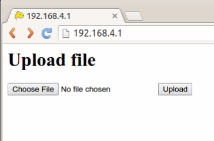
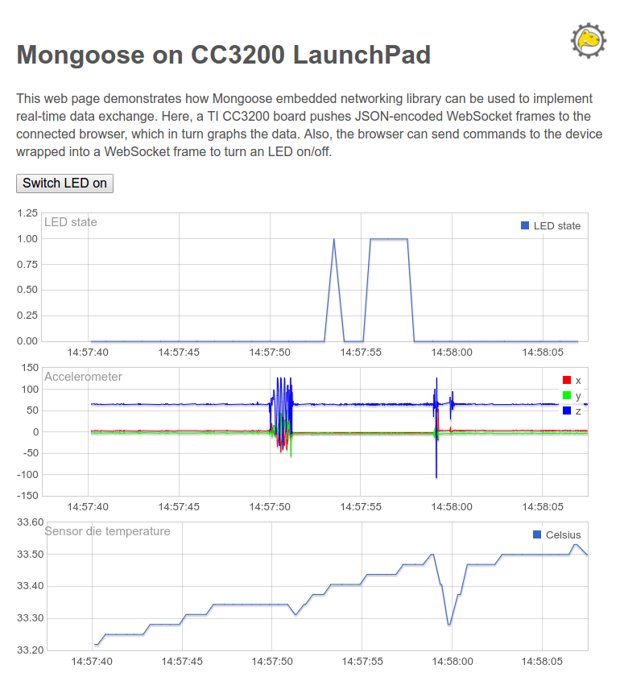

# Code Composer Studio example projects

To run them you will need:
 - [CC3200-LAUNCHXL](http://www.ti.com/tool/cc3200-launchxl) dev board.
 - [CC3200SDK 1.2.0](http://www.ti.com/tool/cc3200sdk) installed in `TI_PRODUCTS_DIR/CC3200SDK_1.2.0` (typically `C:\ti\CC3200SDK_1.2.0` on Windows, `/home/USER/ti/CC3200SDK_1.2.0` on Linux).
 - The latest CC3200SDK-SERVICEPACK should also be installed and flashed to the device
 - Code Composer Studio 6 IDE
 - Mongoose source code. Either clone the [Git repo](https://github.com/cesanta/mongoose.git) or download the [ZIP archive](https://github.com/cesanta/mongoose/archive/master.zip).

## Mongoose - The library project
This project produces `Mongoose.lib` - a static library meant to be used by other projects.
Feel free to use it as a dependency for your own projects or just copy `mongoose.c` and `mongoose.h`.
Note that by default a lot of features are enabled, including file serving (which we use in our examples).
You can trim a lot of fat by turning various build options off.
A minimal HTTP serving configuration is about 25 K (compiled for ARM® Cortex®M4 with GCC 4.9 with size optimization on).

## MG_hello - A simple demo
MG_hello project is a simple web server that serves files from the SimpleLink file system and allows them to be uploaded.
This project depends on the Mongoose library project, make sure you import them both.
When importing, ensure the “copy project to workspace” checkbox is *unchecked*, otherwise file references will be broken.

When built and run on the device, by default, the example will set up a Wi-Fi network called “Mongoose” (no password).

Assuming everything works, you should see the following output in CIO:

```
main                 Hello, world!
mg_init              MG task running
mg_init              Starting NWP...
mg_init              NWP started
wifi_setup_ap        WiFi: AP Mongoose configured
```

Note: If the demo does not proceed past “Starting NWP…”, please reset the board (possibly related to [this](https://e2e.ti.com/support/wireless_connectivity/simplelink_wifi_cc31xx_cc32xx/f/968/p/499123/1806610#1806610) and our [workaround](https://github.com/cesanta/mongoose/commit/848c884fff80de03051344e230392a68d4b51b84) is not always effective).

And after connecting to Wi-Fi network Mongoose, the following page on http://192.168.4.1/:



Pick a small file (say favicon.ico) and upload.
You should get “Ok, favicon.ico - 16958 bytes.” and it will be served back to you ([link](http://192.168.4.1/)).
If you upload index.html, it will be served instead of the form (but the form will be accessible at [/upload](http://192.168.4.1/upload)).

## MG_sensor_demo - A more elaborate demo project

This demo shows the use of [timers](https://docs.cesanta.com/mongoose/latest/#/c-api/net.h/mg_set_timer/) and serving a WebSocket data stream to (potentially) multiple subscribers.
Data from the on-board temperature sensors and accelerometer is streamed to any clients connected over WebSocket, which allows building of responsive, near-real time dashboards.

The main [event handler function](https://github.com/cesanta/mongoose/blob/master/examples/CC3200/main.c#L81) in main.c does everything MG_hello’s function does, but also handles the websocket connection event - when `MG_EV_WEBSOCKET_HANDSHAKE_DONE` arrives, it switches the event handler to a different one - data_conn_handler (defined [here](https://github.com/cesanta/mongoose/blob/master/examples/CC3200/data.c#L144) in data.c). Doing this is not required, but it keeps the code modular and function size manageable.

Data acquisition is performed at regular intervals by a timer. Mongoose timers are not very accurate (remember - everything is executed in single thread), but good enough for this case.The timer is first set [in mg_init()](https://github.com/cesanta/mongoose/blob/master/examples/CC3200/main.c#L200), and the `MG_EV_TIMER` event is handled [in the main handler](https://github.com/cesanta/mongoose/blob/master/examples/CC3200/main.c#L123). Mongoose timers must be re-armed manually.

To try this demo from Code Composer Studio IDE, follow the steps above for MG_hello. Same as for MG_hello, you will only see an upload for initially. Please upload `main.js` and `index.html` from the [slfs directory](https://github.com/cesanta/mongoose/tree/master/examples/CC3200/slfs) and reload the page. You should see something like this:



[This short video](https://youtu.be/T0aFUKIBZxk) shows the demo in action.
