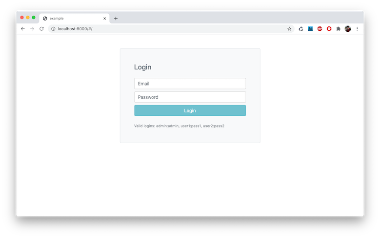
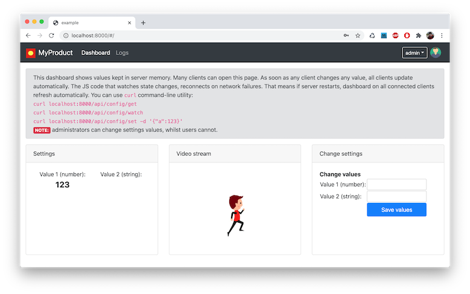
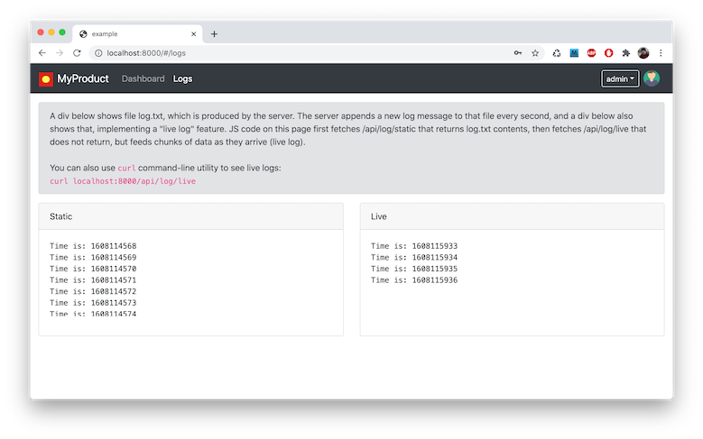

# A complete device dashboard

This example is a demonstration of how Mongoose Library could be integrated
into an embedded device and provide a complete device dashbord with the
following features:

- Multiple logins with different permissions (admin and user)
- Login screen for non-authenticated connections
- A [preact](https://preactjs.com/)-based dashboard with multiple pages
- Internal variables
- A form that changes those variables
- All changes are propagates to all connected clients
- Live log stream
- Live video stream

In essense, this example is a combination of several other examples
pulled together (multiple-logins, dashboard, live-log, video-stream).

# Screenshots

This is a login screen that prompts for user/password

# Main dashboard

A main dashboard page shows internal data, live video stream, and a form

A live log page shows live log stream coming from device

