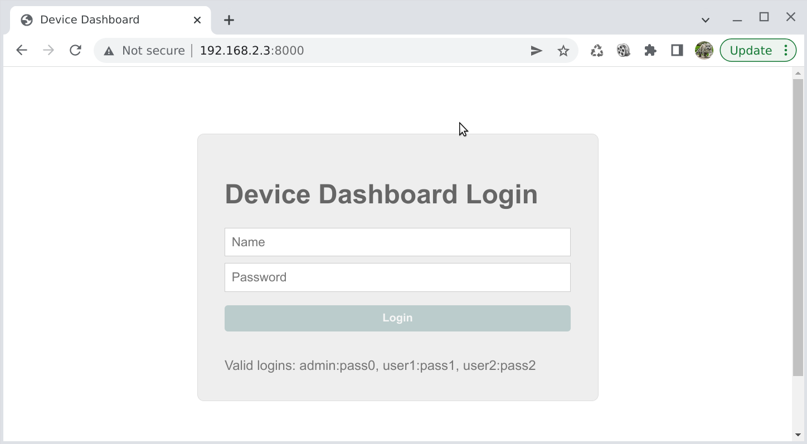
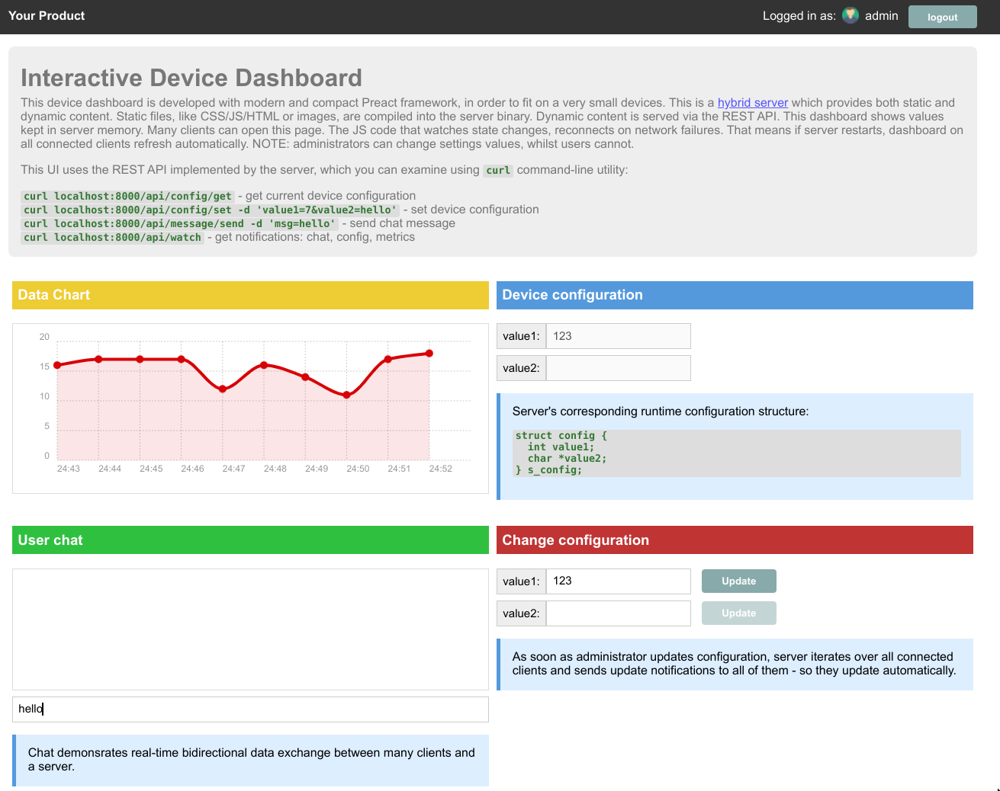

# A complete device dashboard

This example is a demonstration of how Mongoose Library could be integrated
into an embedded device and provide a complete device dashboard with the
following features:

- Authentication: login-protected dashboard
- Multiple logins with different permissions (admin and user)
- Web UI is fully embedded into the server/firmware binary, and does not
  need a filesystem to serve it. UI is resilient to FS problems
- Administrators can change server settings
- All changes are propagates to all connected clients
- A device is connected to the external MQTT server
- Logged in clients can send/receive messages to a device which get
  forwarded to MQTT

# Screenshots

This is a login screen that prompts for user/password

# Main dashboard

A main dashboard page shows and interactive MQTT console

