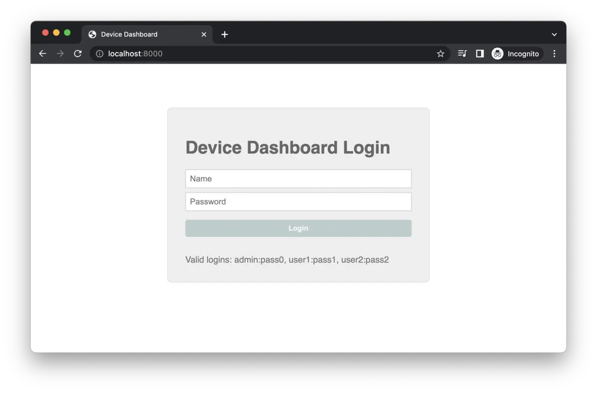
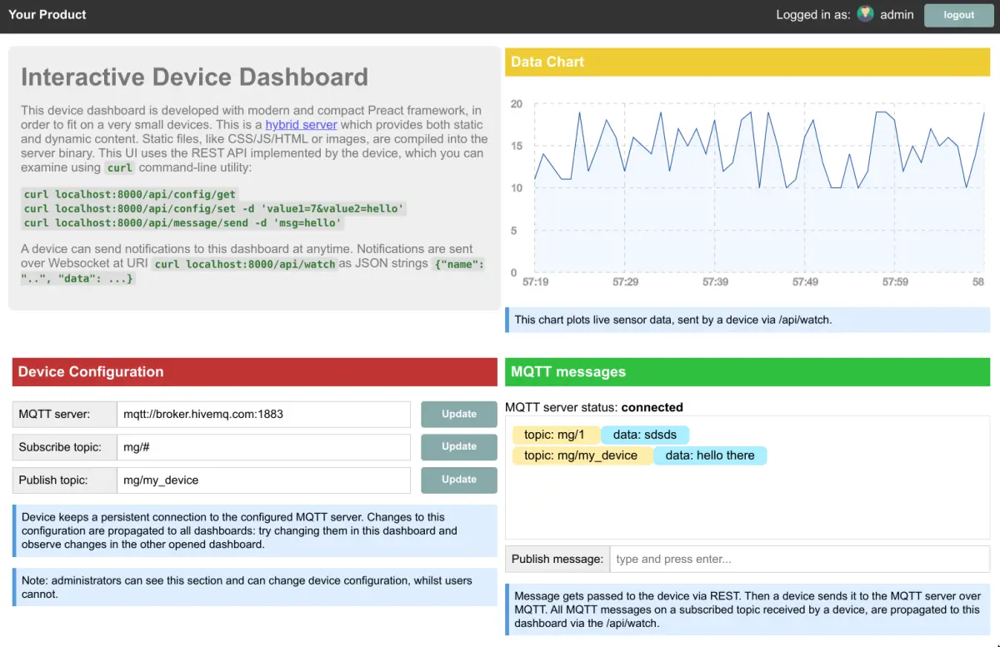

# A complete device dashboard

This example is a demonstration of how Mongoose Library could be integrated
into an embedded device and provide a complete device dashboard with the
following features:

- Authentication: login-protected dashboard
- Multiple logins (with possibly different permissions)
- The Web UI can be fully embedded into the firmware binary, then not
  needing a filesystem to serve it; so being resilient to FS problems
- All changes are propagated to all connected clients

## Screenshots

This is a login screen that prompts for user/password

## Main dashboard

The main dashboard page shows the interactive console

See a detailed tutorial at https://mongoose.ws/tutorials/device-dashboard/
