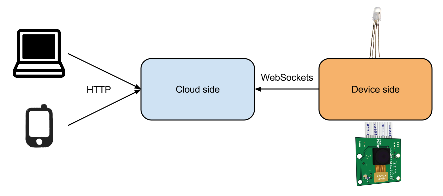

= Raspberry Pi camera/LED demo

== Overview

The link:/[demo] consists of web app providing access to a webcam and a LED attached to a RaspberryPi.
The device is assumed to have a limited bandwidth towards the server hosting the web app.

== Objective

The demo shows how to use websockets to communicate bidirectionally with an embedded device using standard protocols.

It also shows that it's possible to use Smart.c to develop also the cloud endpoint and expose WebSocket and RESTful APIs
easy to integreate with modern web stacks.

== How it works

There are two components, once with runs on the device (`device_side`) and one that runs on a stronger machine
and with more bandwidth (`cloud_side`).

The device app connects to the cloud app via websocket and sends a new jpeg frame as fast as the underlying `raspistill` camera
grabbing application can handle. The device automatically attempts reconnecting.

The cloud side serves the webapp static pages and serves an MPJEG image on `/mpjg`.
The MPJEG image handler blocks all the clients until a JPEG frame arrives via websocket
and then every client will receive a copy of the frame.

The web app can turn on and off the LED via a RESTful api accessible via the `/api` handler.

== Installation

=== Server side

----
git clone https://github.com/cesanta/mongoose
cd mongoose/examples/web_demo
make cloud_side && ./cloud_side 0.0.0.0:8080
----

=== Raspberry Pi

The instructions provided here are tailored for the Raspbian distribution.

==== Dependencies

jpegoptim::
apt-get install jpegoptim

camera::
run raspi-config and enable camera

==== LED

In order to access the led on your link:http://www.qdh.org.uk/wordpress/?page_id=15[HotPi]
board you need to export the gpio pins:

----
for i in 22 23 24; do
  echo $i >/sys/class/gpio/export
  echo out >/sys/class/gpio/gpio$i/direction
  chgrp pi /sys/class/gpio/gpio$i/value
done
----

==== Build and run

----
git clone https://github.com/cesanta/mongoose
cd mongoose/examples/web_demo
make device_side && ./device_side yourserver:8080
----
