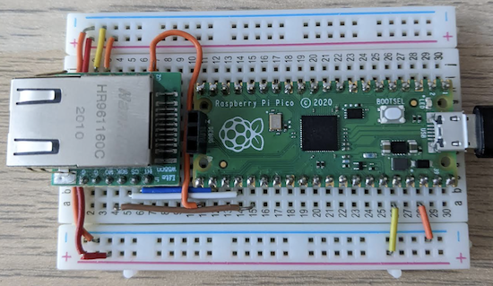
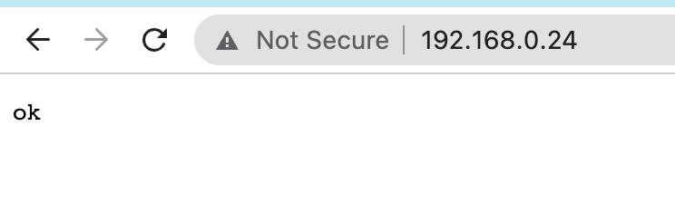

# RP2040 with W5500 Ethernet module

This repository demonstrates how to use RP2040 with W5500 Ethernet module,
to implement networking. In this example, a very simple HTTP server is
implemented. See [other examples](../..) for more functionality.

## RP2040 Pico wiring

The W5500 module uses SPI for communication. The following pins are used
by this example (modify `main.c` if you use a different pinout):

```c
enum { LED = 25, SPI_CS = 17, SPI_CLK = 18, SPI_TX = 19, SPI_RX = 16 };
```

On a breadboard, it might look like this:



## Pinout reference


## Build and run

Clone Mongoose repo, go to this example, and build it:

```sh
git clone https://github.com/cesanta/mongoose
cd mongoose/examples/ro2040/pico-w5500
make
```

The above will make a firmware in `build/example.uf2`. Reboot your Pico
board in bootloader mode, and copy `example.uf2` to the RPI disk.

Attach serial console. Then, plug in Ethernet cable:

```
$ cu -l /dev/cu.usb* -s 115200
4653 2 main.c:79:main                   Ethernet: down
520b 2 main.c:79:main                   Ethernet: down
5dc3 2 main.c:79:main                   Ethernet: down
6593 1 mongoose.c:6757:onstatechange    Link up
659a 3 mongoose.c:6840:tx_dhcp_discover DHCP discover sent
667b 3 mongoose.c:6723:arp_cache_add    ARP cache: added 192.168.0.1 @ 90:5c:44:55:19:8b
667d 2 mongoose.c:6749:onstatechange    READY, IP: 192.168.0.24
667e 2 mongoose.c:6750:onstatechange           GW: 192.168.0.1
6680 2 mongoose.c:6752:onstatechange           Lease: 86062 sec
697b 2 main.c:79:main                   Ethernet: up
7533 2 main.c:79:main                   Ethernet: up
```

Note the aquired IP address printed. Run a browser, and type that IP address
in the address field. You should see an "ok" message in a browser:


