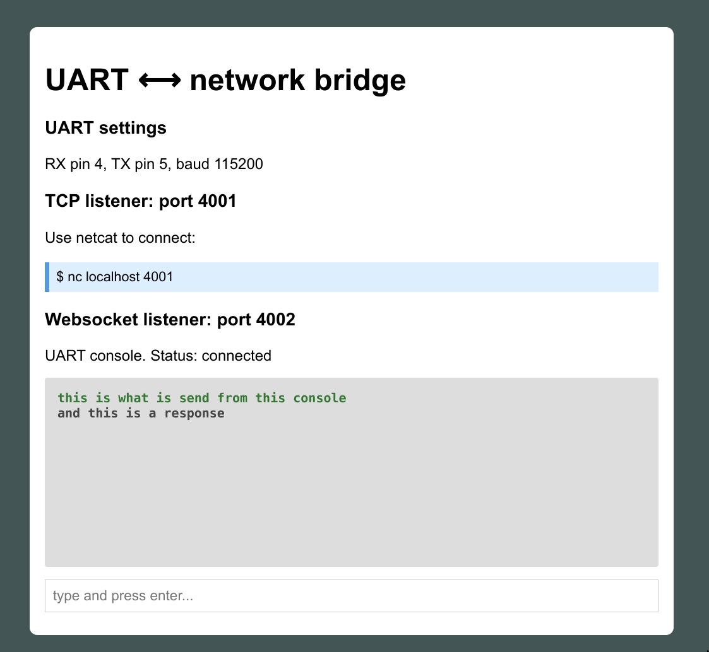

# A UART to network bridge

This example is a demonstration of how Mongoose Library could be integrated
into an embedded device and provide a UART-to-Network bridge capability:

- The device opens listening TCP and Websocket ports and waits for connections
- When a client connects, data is exchanged with the device's UART
- Everything the client sends, is sent to the UART
- Everything that is read from the UART, gets sent to the client
- Multiple clients are allowed
- Live UART console allows to talk to the UART from the web page
- Web UI is hardcoded into the binary and does not need a filesystem

See a detailed tutorial at https://mongoose.ws/tutorials/uart-bridge/